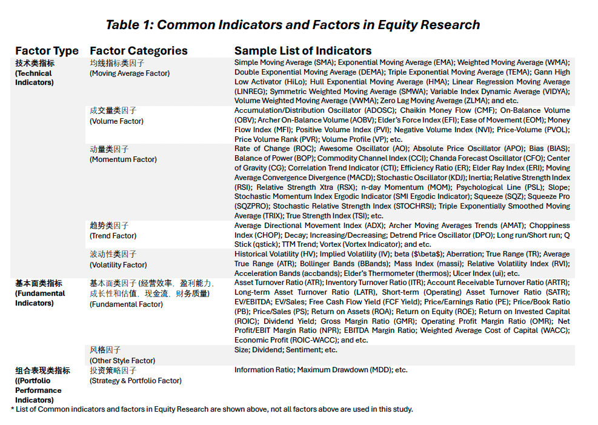

# 投资策略及模型规划 Investment Strategy Outlook 


<span style="color:red;font-weight:700;font-size:18px">Internal Version, DO NOT disseminate!</span>  
  
<span style="color:red;font-weight:700;font-size:18px">内部版本 请勿外传!</span> 

## 研究目标 Research Objectives 


For the purpose in discovering the potential U.S. equity investment opportunities, we are attempting to utilize a quantitative methodology based on a programming approach which adapts a price/volume or trend trading strategy by constructing a model using a combination of objective evaluation criteria, technical indicators, and fundamental factors.


## 投资策略的思考 Considerations on Investment Strategy 

The major investment goals are:

* Construct a stock-only portfolio with (appropriate) maximized expected upside returns in the long-run;

* Construct the portfolio such overall and continuous downside risks are minimized.

$\Rightarrow$ Investment Goal: Construct a (stock-only) portfolio with maximum long-term risk-adjusted returns while controlling the drawdown proactively.

主要投资目标是：

构建一个仅包含股票的投资组合，在长期内实现（适当的）最大化预期上行回报；
构建这样的投资组合，以最小化整体和持续的下行风险。
$\Rightarrow$ 投资目标：构建一个（仅限股票的）投资组合，在控制最大回撤的同时实现最大的长期风险调整回报。

In order to select a pool of U.S. stocks (from the major U.S. Indexes) which are in consistent with the preset investment goals & risk preferences, we consider the following trading perspectives:

* In the world of trading, signals are **indicators** which are derived from various continuously changing statistics and variables, and guide the investors on trading directions (buy, sell, and hold).

* Such signals or indicators help the traders and PMs becoming more informed and aware of the current market performance/conditions.

为了从主要的美国指数中选择一批符合预设投资目标和风险偏好的美国股票，我们考虑以下交易视角：

在交易世界中，信号是指标，它们是从各种不断变化的统计数据和变量中衍生出来的，并指导投资者的交易方向（买入、卖出和持有）。
这样的信号或指标帮助交易者和投资经理们更加了解和意识到当前市场表现/条件。

There are two major approaches to classify the indicators or to analyze any asset, i.e. technical analysis & fundamental analysis:

* **Fundamental analysis** focuses on the performance of an asset by studying various factors/indicators, which may impact the asset price, such as the company's earnings, its cash flow statement and balance sheet, operating efficiency, corporate governance, sector outlook, macro trend, and etc.

* Unlike the income statement modeling and industry/sector research conducted by the fundamental analysis, **technical analysis** aims to predict the future movements(patterns and trends) of certain indicators of an asset (mostly price and volume related); based soley on the historical/past characteristics of various technical indicators, which are (typically) displayed graphically in charts.

分析任何资产的两种主要方法是技术分析和基本分析：

基本分析关注通过研究可能影响资产价格的各种因素/指标（如公司收益、现金流量表和资产负债表、运营效率、公司治理、行业前景、宏观趋势等）来评估资产的表现。
与基本分析所进行的损益表建模和行业/部门研究不同，技术分析旨在预测某资产的某些指标（主要是价格和成交量相关）的未来运动（模式和趋势）；仅基于各种技术指标的历史/过去特性，这些通常在图表中以图形方式显示。

The core assumptions behind these two major methods are that:

(1) The fundamental analysis approach uses information (directly or indirectly) related to the asset itself (e.g EBITDA of the firm), and assumes those information were already factored into the market price fluctuations in time (the EMH).
    By identifying the historical patterns of these indicators or factors, and assuming they provide sufficient information in predicting the (future) trend, one can predict such indicator for the near future (e.g FY26E \$EPS).
    Further, utilizing modern finance models like the CAPM and the multi-factor models with Machine Learning, future asset price movements can be predicted with more confidence (however, not necessarily accuracy).

(2) the assumptions for the technical analysis approach are much simpler.
    One believes that the historical up/down trend of a technical indicator will continue on that path or the path will reverse in the near-term future.
    In other words, technical indicators like price and trading volume, are assumed to move in trends or counter trends, which are repetitive, with certain patterns reoccurring, i.e.
    History will repeat itself (Example: momentum trading strategy and mean reversion strategy).

这两种主要方法背后的核心假设是：

(1) 基本分析方法使用与资产本身（直接或间接）相关的信息（例如公司的EBITDA），并假设这些信息已经及时反映在市场价格波动中（有效市场假说）。通过识别这些指标或因素的历史模式，并假设它们提供了预测（未来）趋势的足够信息，人们可以预测近期未来的某些指标（例如FY26E $EPS）。此外，利用现代金融模型，如CAPM和多因素模型以及机器学习，可以更有信心地预测未来资产价格的变动（然而，不一定准确）。

(2) 技术分析方法的假设要简单得多。人们相信，技术指标的历史上升/下降趋势将继续沿着该路径，或者在近期未来路径将反转。换句话说，像价格和交易量这样的技术指标，被假设为按趋势或反趋势移动，这些趋势是重复的，某些模式会重现，即历史将重演（例如：动量交易策略和均值回归策略）。

With the research goal in building a portfolio with maximum long-term risk-adjusted returns while controlling the maximum drawdown, we certainly need to invest in a pool stocks with the largest winning probability in gaining positive investment returns and with the least amount of volatility.

By acknowledging the usefulness and limitations of fundamental and technical analysis, we can design a quantitative model based on these analytically methodologies to build a portfolio which best suit our preset investment goals and risk preferences.

在构建一个在控制最大回撤的同时实现最大长期风险调整回报的投资组合的研究目标中，我们当然需要投资于一批具有在获得积极投资回报上最大获胜概率并且波动性最小的股票。

通过认识到基本分析和技术分析的用处和局限性，我们可以基于这些分析方法设计一个量化模型，以最适合我们预设的投资目标和风险偏好来构建投资组合。

```{r eval=FALSE, message=FALSE, warning=FALSE, include=FALSE}
# Clean the environment
rm(list = ls())
```

```{r message=FALSE, warning=FALSE, include=FALSE}
### Load packages
library(tsibble)
library(lubridate)
library(tidyverse)
library(quantmod)
library(rvest) 
library(xts)
library(TTR)
library(blotter)
library(rvest)
library(quantstrat)
library(zoo)
library(knitr)
library(kableExtra)
library(readxl)
library(plotly)
library(ggplot2)
library(shiny)
library(DT)
library(flextable)
library(htmltools)
library(readr)
library(cowplot)
library(ggpubr)
library(htmltools)
library(stringr)
```

```{r echo=FALSE, message=FALSE, warning=FALSE, fig.pos='H'}
FactorType = c(rep("技术类指标(Technical Indicators)",5),"基本面类指标(Fundamental Indicators)","基本面类指标(Fundamental Indicators)","组合表现类指标((Portfolio Performance Indicators)")

FactorCategories = c("均线指标类因子(Moving Average Factor)","成交量类因子(Volume Factor)","动量类因子
(Momentum Factor)","趋势类因子(Trend Factor)","波动性类因子(Volatility Factor)","基本面类因子(经营效率，盈利能力，成长性和估值，现金流，财务质量)(Fundamental Factor)","风格因子(Other Style Factor)","投资策略因子(Strategy & Portfolio Factor)") 

SampleListofIndicators = c("Simple Moving Average (SMA); Exponential Moving Average (EMA); Weighted Moving Average (WMA); Double Exponential Moving Average (DEMA); Triple Exponential Moving Average (TEMA); Gann High Low Activator (HiLo); Hull Exponential Moving Average (HMA); Linear Regression Moving Average (LINREG); Symmetric Weighted Moving Average (SMWA); Variable Index Dynamic Average (VIDYA); Volume Weighted Moving Average (VWMA); Zero Lag Moving Average (ZLMA); and etc.", "Accumulation/Distribution Oscillator (ADOSC); Chaikin Money Flow (CMF); Price Volume Trend (PVT); On-Balance Volume (OBV); Archer On-Balance Volume (AOBV); Elder’s Force Index (EFI); Ease of Movement (EOM); Money Flow Index (MFI); Positive Volume Index (PVI); Negative Volume Index (NVI); Price-Volume (PVOL); Price Volume Rank (PVR); Volume Profile (VP); etc.","Rate of Change (ROC); Awesome Oscillator (AO); Absolute Price Oscillator (APO); Bias (BIAS); Balance of Power (BOP); Commodity Channel Index (CCI); Chanda Forecast Oscillator (CFO); Center of Gravity (CG); Correlation Trend Indicator (CTI); Efficiency Ratio (ER); Elder Ray Index (ERI); Moving Average Convergence Divergence (MACD); Stochastic Oscillator (KDJ); Inertia; Relative Strength Index (RSI); Relative Strength Xtra (RSX); n-day Momentum (MOM); Psychological Line (PSL); Slope; Stochastic Momentum Index Ergodic Indicator (SMI Ergodic Indicator); Squeeze (SQZ); Squeeze Pro (SQZPRO); Stochastic Relative Strength Index (STOCHRSI); Triple Exponentially Smoothed Moving Average (TRIX); True Strength Index (TSI); etc.","Average Directional Movement Index (ADX); Archer Moving Averages Trends (AMAT); Choppiness Index (CHOP); Decay; Increasing/Decreasing; Detrend Price Oscillator (DPO); Long run/Short run; Q Stick (qstick); TTM Trend; Vortex (Vortex Indicator); and etc.","Historical Volatility (HV); Implied Volatility (IV); beta ($\beta$); Aberration; True Range (TR); Average True Range (ATR); Bollinger Bands (BBands); Mass Index (massi); Relative Volatility Index (RVI); Acceleration Bands (accbands); Elder’s Thermometer (thermos); Ulcer Index (ui); etc.","Asset Turnover Ratio (ATR); Inventory Turnover Ratio (ITR); Account Receivable Turnover Ratio (ARTR); Long-term Asset Turnover Ratio (LATR), Short-term (Operating) Asset Turnover Ratio (SATR); EV/EBITDA; EV/Sales; Free Cash Flow Yield (FCF Yield); Price/Earnings Ratio (PE); Price/Book Ratio (PB); Price/Sales (PS); Return on Assets (ROA); Return on Equity (ROE); Return on Invested Capital (ROIC); Dividend Yield; Gross Margin Ratio (GMR); Operating Profit Margin Ratio (OMR); Net Profit/EBIT Margin Ratio (NPR); EBITDA Margin Ratio; Weighted Average Cost of Capital (WACC); Economic Profit (ROIC-WACC); and etc.","Size; Dividend; Sentiment; etc.","Information Ratio; Maximum Drawdown (MDD); etc.")

allfactortable <- data.frame(FactorType,FactorCategories,SampleListofIndicators)

allfactortable <-allfactortable %>%
  rename("Factor Type" = FactorType,
         "Factor Categories" = FactorCategories,
         "Sample List of Indicators" = SampleListofIndicators)
```   


```{r echo=FALSE, message=FALSE, warning=FALSE}

```


## 模型设计的思考 Considerations on Model Designs 

In achieving the ultimate investment goal of building a 'high-return and low-risk' stock-only portfolio, we are aiming to build a quantitative model with the most effective components.

There are countless relative metrics and factors evaluating an asset or a firm, whether the particular indicator/factor is **significant** to the price movements is a question in much more depth.

为了实现构建一个“高回报和低风险”的仅限股票投资组合的最终投资目标，我们旨在构建一个具有最有效组成部分的量化模型。

评估资产或公司的相关度量和因素有无数个，特定指标/因素对价格运动是否显著是一个更深入的问题。

To have 'meaningful' model components, we will divide and concur the research objectives by first selecting stocks with near-term investment opportunities (the `base model`).
Following, we will then filter the selected list of stock more rigorously so the positive investment return are more 'certain' for the longer-term with minimal downside risk (the `full model`).

In other words, the `base model` will input the **significant** technical indicators to select a list of 'possible winning' U.S stocks (with potential investment opportunities).
Following, the `complete model` (*Section 5*) will include the **significant** fundamental indicators/factors to further filter from the list of selected stocks, and keep the ones with 'higher certainty' of long-term risk-adjusted (investment) returns.

除了根据具有最大投资回报潜力的适当和显著指标/因素选择股票外，模型还将包括主观过滤器，以满足特定的投资需求/目标（例如：能够买入并持有、投资兴趣的热点领域）、风险偏好和合规要求（例如：投资于市值大于7亿美元的市场）。

为了拥有“有意义”的模型组件，我们将通过首先选择具有近期投资机会的股票（基础模型）来分而治之，实现研究目标。接下来，我们将更严格地筛选选定的股票列表，以使长期内积极投资回报更“确定”，并将下行风险降至最低（完整模型）。

换句话说，基础模型将输入显著的技术指标，以选择一系列“可能获胜”的美国股票（具有潜在投资机会）。接下来，完整模型（第5节）将包括显著的基本面指标/因素，以进一步从选定的股票列表中筛选，并保留那些具有“更高确定性”的长期风险调整（投资）回报的股票。

Besides selecting stocks based on appropriate and significant indicators/factors with the greatest investment return potentials, the model will also include **subjective filters** to suit specific investment needs/goals (example: able to buy and hold, hot areas of investment interest), risk preferences, and compliance requirements (example: invest in market cap $>\$7B$)。


A **technical indicator** is basically a mathematical representation and manipulation of the basic raw trading data and statistics of an asset (e.g. adj close price, trading volume, 52-week high and low, etc.).
In other words, a technical indicator is usually a derivation of the raw trading statistics and is designed to represent/signal certain market behavior.

* Traders typically view the technical indicators as tools on a trading chart to analyze the market trend in a clearer manner. In trading, a technical indicator is like a financial compass, which provides certain market behavior insights (overbought, oversold, potential reversal, range-bound, etc), so investment opportunities and risks can be identified more clearly and intuitively. Traders and PMs can utilize a combination of technical indicators to make informed real-time trading decisions with more confidence.

过滤条件是主观设定的，同时可以根据其他投资需求与风险偏好进行筛选。

技术指标基本上是资产的基本原始交易数据和统计数据（例如，调整后收盘价、交易量、52周高低等）的数学表达和操作。换句话说，技术指标通常是原始交易统计数据的衍生物，旨在表示/信号某种市场行为。

交易者通常将技术指标视为交易图表上的工具，以更清晰的方式分析市场趋势。在交易中，技术指标就像是一个金融指南针，提供某些市场行为洞察（超买、超卖、潜在反转、区间震荡等），因此可以更清晰、直观地识别投资机会和风险。交易者和投资经理可以利用技术指标的组合，以更高的信心做出有根据的实时交易决策。


One of the ultimate goals in any type of security analysis is to understand/predict the ‘direction’ of the asset’s future price movements.
There are various technical indicators that traders use to predict/deduce future price levels (*Section 2.2*).

* One of the common technical trading strategies is momentum trading, which is also the core assumptions we made in building the stock selection model. A stock that has been rising is said to have positive momentum while a stock that has been crashing is said to have negative momentum. Momentum is an investing factor that aims to benefit from the ongoing trend of a stock or asset. 

* Momentum trading centers on buying and selling assets following their recent performance trends. Traders using this strategy believe that assets moving strongly in a direction will continue to do so. They aim to capitalize on this momentum before it fades.  

*Trend followers believe that stocks moving up or down will continue on that path.

In contrast, mean reversion suggests that assets overreact and will eventually return to their mean values.Momentum trading thrives in markets exhibiting strong trends.
It’s less effective in sideways or highly volatile markets.
Therefore, identifying the right market conditions is critical for success.
Sudden market reversals can quickly erode gains.
Hence, effective risk management is essential.

Technical Indicators do not follow a general pattern, meaning, they behave differently with every security.
What can be a good indicator for a particular security, might not hold the case for the other.
Thus, using a technical indicator requires jurisprudence coupled with good experience.

在任何类型的证券分析中，理解/预测资产未来价格运动的‘方向’是最终目标之一。交易者使用各种技术指标来预测/推断未来价格水平（第2.2节）。

一个常见的技术交易策略是动量交易，这也是我们在构建股票选择模型时做出的核心假设。一只一直上涨的股票被认为具有正动量，而一只一直下跌的股票被认为具有负动量。动量是一个投资因素，旨在从股票或资产的持续趋势中获益。
动量交易策略集中在根据近期表现趋势买卖资产。使用这种策略的交易者相信，强势移动的资产将继续这样做。他们旨在在这种动量消退之前利用它。
趋势跟随者相信，上涨或下跌的股票将继续沿着那个路径。
相反，均值回归认为，资产会过度反应并最终回归到它们的平均值。动量交易在展现强趋势的市场中蓬勃发展。在横盘或高波动市场中效果较差。因此，识别正确的市场条件对于成功至关重要。突然的市场反转可以迅速侵蚀收益。因此，有效的风险管理是必不可少的。

技术指标不遵循一般模式，意味着，它们对每种证券的表现都不同。对于特定证券可能是好的指标，对于另一种则可能不适用。因此，使用技术指标需要谨慎并结合丰富的经验。

<div style="text-align: right;">
**返回目录  **[快速索引 Quick Table of Contents] 
</div>


<!-- Disclaimer section with a gray bar -->
<div style="width: 100%; height: 20px; background-color: grey;"></div>

<!-- Disclaimer Text -->
<div style="padding: 20px; margin-top: 20px; background-color: #f1f1f1;">
    内部资料，请勿外传! 

    Internal documents, please do not disseminate! 

    本网页模型搭建说明及模型网络应用仅供参考。无论是所含信息还是所表达的观点，
    均不得明示或暗示为任何形式的建议、提供、招揽、邀请、广告、诱导、推荐或代表，
    以买卖任何证券、金融工具或任何投资或其他特定产品。

    The web-based Quantitative Model e-Manual and web application are for information
    purposes only. The information and opinion contained and expressed herein, shall not,
    and shall not be deemed to, construed, expressly or impliedly, as advice, offer or
    solicitation of an offer, invitation, advertisement, inducement, recommendation, or
    representation of any kind or form whatsoever to buy or sell any security, financial
    instrument or any investment or other specific product.
</div>
