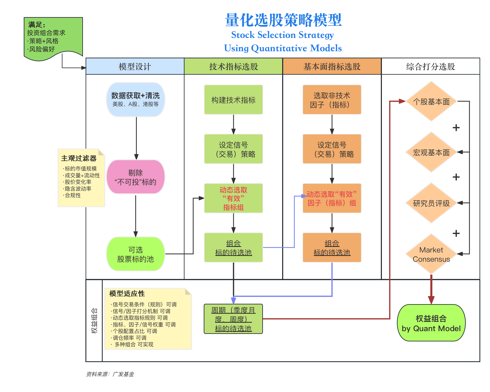

# 基础模型搭建 (Base) Model Construction 


<span style="color:red;font-weight:700;font-size:18px">Internal Version, DO NOT disseminate!</span>  
  
<span style="color:red;font-weight:700;font-size:18px">内部版本 请勿外传!</span> 

## 模型设计搭建概要 Intro on (Base) Model Design and Construction 

```{r eval=FALSE, message=FALSE, warning=FALSE, include=FALSE}
# Clean the environment
rm(list = ls())
```

```{r message=FALSE, warning=FALSE, include=FALSE}
### Load packages
library(tsibble)
library(lubridate)
library(tidyverse)
library(quantmod)
library(rvest) 
library(xts)
library(TTR)
library(blotter)
library(rvest)
library(quantstrat)
library(zoo)
library(knitr)
library(kableExtra)
library(readxl)
library(plotly)
library(ggplot2)
library(shiny)
library(DT)
library(flextable)
library(htmltools)
library(readr)
library(cowplot)
library(ggpubr)
library(htmltools)
library(stringr)
library(reshape2)
library(lubridate)
library(purrr)
```

The design of the stock-selection model is heavily dependent on the portfolio strategy and risk preferences.
To reiterate, the `base model` will select stocks signaling near-term investment opportunities based on a combination of **technical indicators**.

Over 6,000 stocks currently listed in the U.S. security market, however, some may not be appropriate for the portfolio (style, risk, compliance, etc.).
For instance, a stock went public one year ago with a market cap of \$10B does not satisfy the investment style and risk reference.
To save computing power, the model will subjectively filter out these 'inappropriate' stocks in advance to any machine selection processes based on indication signals.

选股模型的设计极度依赖于投资组合的策略和风险偏好。重申一点，`基础模型`将根据一组（多个）**技术指标**选出具有短期投资机会的股票。

当前在美国证券市场上市的股票超过6,000支，然而，有些可能不适合投资组合（风格、风险、合规等）。例如，一家市值为100亿美元、一年前上市的股票，可能不符合投资风格和风险偏好。为了节省计算资源，模型将主观地提前筛选掉这些“不适当”的股票，避免在基于指示信号的机器选择过程中考虑它们。

More specifically:

* Step 1: Fetch market data:

The model will gather up-to-date raw trading data and statistics (open, close, volume etc.) for stocks currently listed on the NYSE and NASDAQ (U.S. stocks listed on the following exchanges: PHLX, MS4X, BSE, CHX, and NSX are excluded in this study).

具体来说：

步骤1：获取市场数据：

模型将收集纽约证券交易所和纳斯达克上市的股票的最新原始交易数据和统计信息（开盘、收盘、成交量等）。本研究中不包括在以下交易所上市的美国股票：PHLX、MS4X、BSE、CHX和NSX。

* Step 2: Drop ‘nonviable’ stocks (Portfolio-specific Filters):

First, the **subjective filters** eliminate the ‘inappropriate’ stocks, which are the ones will not be considered as a viable investment option; because of the unmatched management styles, internal risk management guidelines, risk preference, investor/client investment preferences/risk tolerance, etc. (subjective: the eliminated securities are due to subjective preset investment goals, management styles or risk management guidelines; but may be stocks could bring substantial future returns).

步骤2：淘汰“非可投”股票（针对投资组合的过滤器）：

首先，主观过滤器将淘汰那些不被视为可行投资选项的“不适当”股票，这些股票因管理风格、内部风险管理指导原则、风险偏好、投资者/客户的投资偏好/风险承受能力等原因而被淘汰（主观原因：淘汰的证券是基于主观设定的投资目标、管理风格或风险管理指导原则，但这些股票可能带来重大的未来回报）。

* Step 3: Calculate the indicators (Technical Indicators Construction):

There are countless of technical indicators, and we will first pick a pool of indicators we deem fit in characterizing the U.S equity price performances.
Following, with a programmatic approach, the model computes the indicator value(s), and produces any meaningful graphs.
In terms of trading signals, we will set conventional signal parameters, where further investment-specific setting adjustments may become necessary.
Moreover, we will use a handful of widely-traded stocks to test whether the program for each technical indicators perform by providing trading signals as intended (not a test on signal accuracy).

步骤3：计算指标（技术指标构建）：

有无数的技术指标，我们将首先挑选一组我们认为适合描述美国股票价格表现的指标。然后，模型将以程序化方法计算指标值，并生成有意义的图表。在交易信号方面，我们将设置常规信号参数，可能需要进一步的投资特定设置调整。此外，我们将使用一些广泛交易的股票来测试每个技术指标的程序是否按预期提供交易信号（这不是对信号准确性的测试）。

* Step 4: Select a combination of significant technical indicators (Technical Indicator Effectiveness Ranking)

The characteristics and preset assumptions of the technical indicators, meaning they behave differently for each market with every security.
For instance, one can be an effective indicator in terms of signaling accuracy for a stock in a more traded sector, may not hold the case for another stock which is less liquid.
Similar applies to the indicator parameters, where different parameter settings may lead to opposite trading signals during different periods.
Whether the following indicators are effective and accurate is questionable.
Thus, the model utilizes a ranking system to objectively determine their effectiveness, i.e. **significant** indicators. Using technical indicators in reaching a profitable trading decision requires jurisprudence coupled with investment experience.

The model methodology is to use the full dataset with all 5,400+ stocks currently listed on NYSE and NASDAQ, to test and rank the technical indicators in terms of the accuracy in giving the correct trading signals (1,997 NYSE, 3,433 NASDAQ as of Feb 22, 2024).
For example, say the RSI accuracy is 70% and No.1 among all technical indicators, by giving the correct next-day trading signals for 3,780+ stocks week-long; which its signal accuracy is higher than any other indicators.
With a programmatic approach, the effectiveness evaluation processes produce an accuracy-based ranking for all input technical indicators.

步骤4：选择一组重要的技术指标（技术指标效力排名）：

技术指标的特性和预设假设意味着它们在每个市场中对每个证券的表现都不同。例如，某个指标可能在交易量较大的行业中对某只股票的信号准确性很高，但对流动性较差的另一只股票则可能不适用。指标参数也是如此，不同的参数设置在不同时间可能导致相反的交易信号。这些指标是否有效和准确是有疑问的。因此，模型使用一个排名系统来客观地确定它们的效果，即重要的指标。使用技术指标做出有利可图的交易决策需要法律审慎和投资经验。

模型的方法是使用所有5400多只目前在纽约证券交易所和纳斯达克上市的股票的完整数据集，测试并排名技术指标在提供正确交易信号的准确性方面的表现（截至2024年2月22日，纽约证券交易所1997只，纳斯达克3433只）。例如，假设RSI的准确性为70%，在所有技术指标中排名第一，能为一周内3780多只股票提供正确的次日交易信号，其信号准确性高于任何其他指标。通过程序化方法，效果评估过程为所有输入的技术指标产生基于准确性的排名。

However, using a technical-only based model emerges a practical and tricky issue, where one **significant** indicator may disagree with another **significant** indicator on trading signals.
A subjective set of indicator parameters may also cause similar mixed-signal issues.
In practice, analysts and PMs reference a combination of the technical indicators, along with other security analysis methods (fundamental, quant, etc.) before arriving at a trading decision (Buy/Sell/Hold).

Moreover, investment strategies usually vary for different fund products.
To have the stock selection model becoming more adaptive and customizable for various investment needs; for example, to be able to output two separate top-30 stock lists for a buy-and-hold strategy and a long-short risk-neutral strategy.
Therefore, the model not only need to be adaptive to input different sets of significant technical indicators (example: 2 sets of technical indicators to **signal for shorter-and-longer-term returns**), but also for numerous combinations of parameter settings.


然而，使用纯技术指标模型引出了一个实际和棘手的问题，其中一个重要的指标可能与另一个重要的指标在交易信号上有所不同。主观设置的指标参数也可能导致类似的混合信号问题。实际操作中，分析师和投资组合经理在做出交易决定（买入/卖出/持有）之前，会参考一组技术指标以及其他证券分析方法（基本面、定量等）。

此外，不同的基金产品通常有不同的投资策略。为了使股票选择模型更加适应和可定制化，以满足各种投资需求；例如，能够输出两个分别为买入持有策略和长短期风险中立策略的前30名股票列表。因此，模型不仅需要适应输入不同组合的重要技术指标（例如：2组技术指标为短期和长期回报发出信号），还需要适应多种参数设置的组合。

More specifically (for Step 4), the model first utilizes the full (U.S. stock) dataset to test and rank the effectiveness of all input technical indicators, and produces two combinations of significant technical indicators, one set for shorter-term (intraday, next day) signals and one set for longer-term signals.

Regarding the parameter settings for the technical indicators, the process in determining the ‘best’ setting is relatively subjective.
It requires manual adjustments for each (of them who needs a parameter input), in which different settings at different sample (testing) periods may result differently.
Most importantly, trading signals directly influenced by the parameter settings; and the investment styles/goals also have direct impact on the settings (e.g. an aggressive strategy, a trend-following strategy, and an EIF strategy certainly requires different parameter settings, and similar applies to initiate trades on the left or right).

更来说（cont.步骤4）：模型首先使用完整的（美国股票）数据集测试并排名所有输入的技术指标的有效性，并生成两组重要的技术指标组合，一组用于短期（当日、次日）信号，另一组用于长期信号。

关于技术指标的参数设置，确定“最佳”设置的过程相对主观。它需要对每一个（需要参数输入的）进行手动调整，在不同的样本（测试）周期中，不同的设置可能会导致不同的结果。最重要的是，交易信号直接受参数设置的影响；投资风格/目标也直接影响设置（例如，激进策略、趋势跟踪策略和EIF策略肯定需要不同的参数设置，类似地，也适用于启动左侧或右侧的交易）。

* Step 5: Stock Selection & Trading Signals – the Base Model   

By finishing the process of datasets inputs, and the elimination of stocks on portfolio-specific (‘nonviable’) filters, the (base) stock selection model can now fetch the up-to-date stock trading statistics through the chosen combinations of significant technical indicators.

By design, every technical indicator generates a trading signal based on the given parameter settings for each stock.
Following, the model counts the number of trading signals generated for each stock.

An aggregate signaling rule needs to be established in advance for the model to generate the trading recommendation, however, this setting can be modified easily to suit specific investment needs and the continuously changing market landscape.

步骤5：股票选择和交易信号 - 基础模型

通过完成数据集输入的过程和基于投资组合特定（“非可投”）过滤器的股票淘汰，（基础）股票选择模型现在可以通过选择的重要技术指标组合获取最新的股票交易统计数据。

根据设计，每个技术指标根据为每只股票设置的参数生成交易信号。随后，模型计算每只股票生成的交易信号数量。

需要事先建立一个综合信号规则，以便模型生成交易建议，但这个设置可以轻松修改，以适应特定的投资需求和不断变化的市场环境。

For example, the PMs can set the rule with a **(theoretical) winning-probability threshold** of 75%, and say from the model output, `stock A` generated 11 `short position` signals from a total of 14 significant technical indicators, which $\frac{11}{14}>75\%$.
The stock-selection model which indicated that `stock A` has a(n) aggregate *SELL* signal as of today.
Obviously, with the subjective setting of the winning probability threshold, the programming approach of the model can automate the tedious and heavy computing process, and produces a list of `BUY` stocks, and a list of `SELL` stocks.

Furthermore, to suit various investment goals/needs like multiple strategies for different portfolios; the model input can easily be modified into two combinations of technical indicators.
As an example, besides generating trading recommendations (BUY/SELL/HOLD) for each stock, the model can further indicate/signal whether which stocks have the investment potential (either direction) for a longer-term (Note: such additional recommendation may be due to the extra combination of technical indicators and/or different indicator settings).

Above summarized the complete processes in detail, to construct an adaptative U.S. stock selection model using only technical indicators (i.e. `the base model`) and to generate trading recommendations accordingly.

例如，投资组合经理可以设置一个**（理论上的）获胜概率阈值**为75%，并且从模型输出来看，股票A从14个重要技术指标中生成了11个做空信号，其中 $\frac{11}{14} > 75%$。股票选择模型指出，截至今日，股票A有一个综合卖出信号。显然，通过主观设置的获胜概率阈值，模型的编程方法可以自动化繁琐和庞大的计算过程，并生成一份买入股票列表和一份卖出股票列表。

此外，为了适应不同投资组合的多种投资目标/需求；模型输入可以轻松修改为两组技术指标的组合。例如，除了为每只股票生成交易建议（买入/卖出/持有）外，模型还可以进一步指示/信号哪些股票具有长期的投资潜力（注意：此类额外的建议可能是由于额外的技术指标组合和/或不同的指标设置）。

以上内容详细总结了使用仅技术指标的适应性美国股票选择模型（即基础模型）构建过程，并相应地生成交易建议。

Note: We believe technical indicators are relatively objective as they are derivations of market data and statistics.
Therefore, by theory, such model should include the less randomness and bias in trading recommendations.
To control portfolio drawdowns, while seeking for higher risk-adjusted returns, we purposely divide the model into two parts and introduce model factors/indicators stepwise.
Other types of analytical data and statistics include somewhat subjectivity, however, the complete stock selection model (i.e. `the full model`) (*Section 5*) will accept significant fundamental, growth/value, volatility, and emotion factors.

请注意，我们认为技术指标相对客观，因为它们是市场数据和统计数据的衍生物。因此，理论上，这样的模型应该在交易建议中包含较少的随机性和偏见。为了控制投资组合回撤，同时寻求更高的风险调整回报，我们有意将模型分为两部分，并逐步引入模型因子/指标。其他类型的分析数据和统计数据包含一定的主观性，然而，完整的股票选择模型（即完整模型）（第5节）将接受重要的基本面、成长/价值、波动性和情绪因素。

* Step 6: Base Model Back-test and RM Additions (Portfolio Simulation [Setting: Base Model, Allocation: Equal Weight])

After gathered the recommended list of stocks to invest generated by the `base model`, the program is set to evaluate the model performance.
A standard back-test is then performed, in which the portfolio is constituted by the model-selected U.S. stocks.
Trades are set to execute in accordance with the model-generated trading signals (BUY/SELL/HOLD), and the set theoretical winning-probability threshold (the aggregate signaling rule).
For the simplicity and the purpose in controlling variables, the asset allocation rule for this simulated portfolio is set to be equal weight.
Finally, the program computes the investment return of the simulated portfolio in percentages.

In constructing a model to select U.S. equities, and assess the strategy performance, we assumed a stock-only portfolio.
In practice, we need to consider the risk exposure.
Effective and proactice risk management is essential for a stock-heavy portfolio.
For instance, depends on the overall volatility from the selected stocks, the PMs can invest in ETFs or appropriate commodities or keep a higher cash or cash equivalent asset to hedge.

步骤6：基础模型回测和RM添加（投资组合模拟[设置：基础模型，配置：等权重]）
在收集了基础模型生成的推荐投资股票列表后，程序设定为评估模型性能。然后进行标准回测，其中投资组合由模型选择的美国股票构成。交易将按照模型生成的交易信号（买入/卖出/持有）和设定的理论获胜概率阈值（综合信号规则）执行。为了简化和控制变量的目的，这一模拟投资组合的资产配置规则设为等权重。最后，程序计算模拟投资组合的投资回报率（百分比）。

在构建选择美国股票的模型并评估策略性能时，我们假设了一个仅限股票的投资组合。在实践中，我们需要考虑风险敞口。有效和积极的风险管理对于股票重的投资组合至关重要。例如，根据所选股票的整体波动性，投资组合经理可以投资于ETFs或适当的商品，或保持较高的现金或等值资产以进行对冲。

以上解释了价格量策略的期望、股票选择模型设计的哲学以及以编程方法构建此类模型的必要步骤。如今，纯技术的量化模型很少见，并且由于缺乏可参考的资料，主观和基本因素通常包含在此类投资组合的构建中。因此，报告详细展示了设计和建模过程中的假设、主观决策和所有影响因素。


```{r 02flow, echo=FALSE, message=FALSE, warning=FALSE}

```

Above has explained in great details about the expectations of the price volume strategy, the philosophy in designing the stock selection model and the necessary steps in constructing such model with a programming approach. A 'technical-only' quantitative model is rare today, and without much reference to follow, subjective and fundamental factors are usually included in constructing such portfolio. Therefore, the report has exhibited the assumptions, subjective decisions, and all influential elements for the designing and modeling processes in detail. 

Following the model flow chart, the sections below will illustrate the the `base model`, include computations, visualizations, analyses, simulations and etc.  

以下部分将展示基础模型，包括计算、可视化、分析、模拟等内容。

*\textcolor{red}{Code Hidden 代码已隐藏}* 

```{r message=FALSE, warning=FALSE, include=FALSE}
# Data Intake
#mega7tidyurl <- url("https://gitee.com/yihuahuang1/stockdata/raw/master/mega7tidy.csv")
#mega7capurl <- url("https://gitee.com/yihuahuang1/stockdata/raw/master/mega7marketcap.csv")
#mega7data = read.csv(mega7tidyurl)
#mega7mcap = read.csv(mega7capurl)
mega7data = read.csv("sp500ohlc_long_clean.csv")
mega7mcap = read.csv("mega7marketcap.csv")
```

```{r echo=FALSE, message=FALSE, warning=FALSE}
mega7data <-
  mega7data %>%
  select(date, symbol, adjusted, close, high, low, open, volume) 


```

```{r eval=FALSE, message=FALSE, warning=FALSE, include=FALSE, paged.print=FALSE}
# Full data part data intake for loop 

# Web-scrape SP500 stock list
sp_500_stock_list <- 
 read_html("https://en.wikipedia.org/wiki/List_of_S%26P_500_companies") %>%
  html_node("table.wikitable") %>%
  html_table() %>%
  select(`Ticker symbol`, Security, `GICS Sector`, `GICS Sub Industry`) %>%
  as_tibble()
# Format names
names(sp_500_stock_list) <- 
  sp_500_stock_list %>% 
  names() %>% 
  str_to_lower() %>% 
  make.names()
# Show results
sp_500_stock_list
```

```{r include=FALSE}
# Full data part data intake for loop 
```

```{r message=FALSE, warning=FALSE, include=FALSE}
# Data cleanup & add marketcap column to the main dataframe
mega7data_modified <- 
  mega7data %>%
  inner_join(mega7mcap, join_by(symbol == Stock)) %>%
  rename(marketcap = Marketcap) 

mega7data_modified$marketcap <- as.numeric(mega7data_modified$marketcap)

mega7data_modified <-
  mega7data_modified %>%
  select(-X)
```  

```{r echo=FALSE, fig.pos='H', message=FALSE, warning=FALSE}
# pdf output
kbl(tail(mega7data_modified,10), booktabs = T, linesep = "", 
    digits = 1, caption = "Cleaned Data Glance: NYSE and NASDAQ Stocks", 
    format.args = list(big.mark = ",", scientific = FALSE)) %>%
  kable_styling(latex_options = c("striped","scale_down",
                                  "HOLD_position"), 
                position = "center") %>%
  column_spec(c(2,3,8,9), bold = T) %>%
  kableExtra::footnote(general = "Output 2.1.a: Latest 10 rows are shown.")
```


```{r fig.pos='H', message=FALSE, warning=FALSE, include=FALSE}
# html output

# Apply comma formatting to "Average Volume" column without change dataset

mega7data_modified_display <- 
  mega7data_modified %>%
  mutate(date = mdy(date)) %>%
  tail(10000)

# mega7data_modified_display$volume <- format(mega7data_modified_display$volume, big.mark = ",")
# mega7data_modified_display$marketcap <- format(mega7data_modified_display$marketcap, big.mark = ",", scientific = FALSE)

# Create the interactive table using DT
DT::datatable(mega7data_modified_display, 
              colnames = c('Date' = 2, 'Symbol' = 3, 'Adjusted Close' = 4, 'Close' = 5,
                           'High' = 6, 'Low' = 7, 'Open' = 8, 'Volume' = 9, 'Market Cap' = 10),
          caption = htmltools::tags$caption(style = 'caption-side: top; 
                                            text-align: center; 
                                            color: black; 
                                            font-size: 200%;', 
                                            'Cleaned Data Glance: NYSE and NASDAQ Stocks'),
          options = list(
            pageLength = 10,
            lengthMenu = c(5, 10, 15, 20),
            searching = TRUE, scrollX = TRUE)) %>%
  formatRound(columns = c('Open', 'Close', 'Adjusted Close',
                          'Close','High','Low','Open'), digits = 2) %>%
  formatRound(columns = c('Volume','Market Cap'), digits = 0)
```

## 其他组合相关过滤指标 Portfolio-specific Subjective Indicators 

With over 6,000 stocks currently lists on the U.S. stock exchanges, the model will first eliminate the 'inappropriate' stocks, i.e. the stocks will not be considered as viable investment opportunities.

The following are the areas we take into considerations in eliminating the 'inappropriate' stocks:

* Investment needs/preset goals & risk preferences (specific to the managed portfolio)
* Management styles (avoid style drift or inconsistent investment styles)
* Liquidity requirements
* Client/Investor needs & risk tolerance
* Internal RM guidelines & compliance requirements

To reiterate, the eliminated stocks are dropped (from the potential investment list) due to the above subjective reasons; in no means these stocks will necessarily bring negative investment returns, some of them could bring substantial (positive) future returns. 

其他组合相关过滤指标
对于目前在美国股市上市的6,000多支股票，模型首先将淘汰那些不被视为可行投资机会的“不适当”股票。

以下是我们在淘汰“不适当”股票时考虑的因素：

投资需求/预设目标和风险偏好（针对被管理的投资组合）
管理风格（避免风格偏移或不一致的投资风格）
流动性要求
客户/投资者需求和风险承受能力
内部风险管理指南和合规要求
需要重申的是，被淘汰的股票是因为上述主观原因被从潜在投资列表中删除的；这并不意味着这些股票必然会带来负面的投资回报，其中一些可能带来可观的（正面的）未来回报。

因此，我们设定了以下主观指标来满足策略需求（这个列表可能会随市场环境的快速变化而修改）：

Thus, we set the following **subjective indicators** to meet the strategy needs (this list may be modified with the fast-changing market landscape): 

(1) $\text{Market Cap}> \$ 7 \text{ billion}$  
(2) $\text{Average Weekly Volume}> 1 \text{ million}$  
(3) $\text{Daily Return} \nless -25\%$  
(4) $\text{Annualized Volatility}\ngtr 250\%$.

市值大于 $7 亿美元

平均每周成交量大于 100 万

日收益率不低于 -25%

年化波动率不大于 250%


### <span style="color:blue">过滤指标1：市值 Subjective Indicator No.1: Market Cap > \$ 7 billion</span>  

The program gathers the most up-to-date (value at close on the last trading day) *market cap* (`market_cap`) for each company, the stocks with a latest market cap smaller than 7 billion USD will be eliminated (from the stock selection list).  

A market cap less than $7 billion, indicates the stock is more growth in nature, and with less analyst coverage. 'Growth stocks' have the growth potential, however tend to be more volatile. To match the investment goals/portfolio needs, satisfy internal RM and compliance guidelines, and actively controlling the drawdown and down-side risks; the model therefore in advance, eliminates these stocks and label them as 'inviable' investment options.  

程序将收集每家公司在最后一个交易日收盘时的最新市值（market_cap），市值低于7亿美元的股票将从股票选择列表中被淘汰。

市值低于7亿美元表明该股票更倾向于成长性，且分析师覆盖较少。成长股具有增长潜力，但通常更加波动。为了匹配投资目标/投资组合需求，满足内部风险管理和合规指南，并积极控制回撤和下行风险；模型因此提前淘汰这些股票，并将它们标记为“不可投资”选项。

*\textcolor{red}{Code Hidden 代码已隐藏}*  

```{r echo=FALSE, message=FALSE, warning=FALSE}
cap_remove_list_intermed <-
  mega7data_modified %>%
  filter(marketcap < 7000) 

cap_remove_list <- 
  pull(cap_remove_list_intermed, symbol)  %>%
  unique()
``` 

```{r echo=FALSE, message=FALSE, warning=FALSE}
mega7data_modified <- 
  mega7data_modified %>%
  filter(!symbol %in% cap_remove_list)

# print(cap_remove_list)

kbl(cap_remove_list, booktabs = T, linesep = "", 
    col.names = "Symbol" , 
    caption = "Stocks Removed by Market Cap") %>%
  kable_styling(latex_options = c("striped", "scale_down",
                                  "HOLD_position"), 
                position = "center", full_width = T) %>%
  #column_spec(c(2), bold = T) %>%
  kableExtra::footnote(general = "Output 2.2.1.a: Last 10 rows are shown.",
           symbol = "Stocks with market cap smaller than 7 billion USD")
```

Above output shows the `cap_remove_list`, i.e. the stocks removed from the `stockdata` dataset due to its *market cap* was smaller than 7 billion USD ($7\times 10^9$) some time during last year, to meet internal RM guidelines, and actively manage the potential downside risks and return fluctuation (drawdown) issues.  

翻译 

### <span style="color:blue">过滤指标2：交易量 Subjective Indicator No.2: Average Weekly Volume > 1 million</span>  

The program first computes the average weekly (trading) `Volume`, the stock with an **average volume** **smaller than 1 million** some time during the last year, will be eliminated (from the stock list).  

A daily (average) trading volume of 1 million or less, indicates the stock was traded  inactively in relative terms. To satisfy internal RM and compliance guidelines, and avoid any liquidity risks; the model therefore in advance, eliminates these stocks and label them as 'inviable' investment options.  

程序首先计算平均每周（交易）Volume，在过去一年中任何时候平均成交量小于100万的股票将从股票列表中被淘汰。

日均（平均）交易量小于或等于100万表明该股票在相对意义上交易不活跃。为了满足内部风险管理和合规指南，并避免任何流动性风险；模型因此提前淘汰这些股票，并将它们标记为“不可投资”选项。

*\textcolor{red}{Code Hidden 代码已隐藏}*  

```{r echo=FALSE, message=FALSE, warning=FALSE}
mega7data_modified <-
  mega7data %>% 
   mutate(date = mdy(date),  
         week = strftime(date, format = "%V"), 
         year = year(date))  
```

```{r echo=FALSE, message=FALSE, warning=FALSE,fig.pos='H'}
mega7data_modified <-
  mega7data_modified %>%
  group_by(year,week,symbol) %>%
  mutate(average.volume = mean(volume)) %>%
  ungroup() 
```

```{r include=FALSE}
weekavg_volume <- 
  mega7data_modified %>%
  select(year, week, date, symbol, average.volume) %>%
  arrange(desc(date))
```

```{r echo=FALSE, fig.pos='H', message=FALSE, warning=FALSE}
# pdf output
kbl(head(weekavg_volume,10), booktabs = T, linesep = "",
    digits = 1, caption = "Average Weekly Trading Volume", 
    format.args = list(big.mark= ",",scientific = FALSE), longtable = T,
    col.names = c("Year","Week","Date","Symbol","Average Volume")) %>%
  kable_styling(latex_options = c("striped", "scale_down",
                                  "HOLD_position"), 
                position = "center") %>%
  column_spec(c(5), bold = T) %>%
  kableExtra::footnote(general = "Output 2.2.2.a: First 10 rows are shown.")
```


```{r message=FALSE, warning=FALSE, include=FALSE}
# html output
# Apply comma formatting to "Average Volume" column without changing the date frame

weekavg_volume_display <- 
  weekavg_volume %>% 
  head(15000)

# weekavg_volume_display$average.volume <- format(weekavg_volume_display$average.volume, big.mark = ",")

# html output
# Create the interactive table using DT
DT::datatable(weekavg_volume_display, 
              colnames = c('Year' = 2, 'Week' = 3, 'Date' = 4, 'Symbol' = 5,
                           'Average Volume' = 6),
              caption = htmltools::tags$caption(style = 'caption-side: top; 
                                            text-align: center; color: black; 
                                            font-size: 200%;',
                                            'Average Weekly Trading Volume'),
              options = list(pageLength = 10, lengthMenu = c(5, 10, 15, 20),
              searching = TRUE, style = list(width = '100%')), extensions = 'Buttons') %>%
  formatRound(columns = 'Average Volume', digits = 0)
```

Table: 2.2.2-a: Interactive **average volume** table

```{r echo=FALSE, message=FALSE, warning=FALSE}
volume_remove_list_intermed <-
  weekavg_volume %>%
  filter(average.volume < 20000) 

volume_remove_list <- 
  pull(volume_remove_list_intermed, symbol)  %>%
  unique()

volume_remove_list
```

```{r echo=FALSE, message=FALSE, warning=FALSE}
mega7data_modified <- 
  mega7data_modified %>%
  filter(!symbol %in% volume_remove_list)

#print(volume_remove_list)

kbl(volume_remove_list, booktabs = T, linesep = "", 
    col.names = "Symbol" , 
    caption = "Stocks Removed by Trading Volume") %>%
  kable_styling(latex_options = c("striped", "scale_down",
                                  "HOLD_position"), 
                position = "center", full_width = T) %>%
  #column_spec(c(2), bold = T) %>%
  kableExtra::footnote(general = "Output 2.2.2.b: Last 10 rows are shown.",
           symbol = "Stocks with average weekly trading volume smaller than 1 million.")
```

Above output shows the `volume_remove_list`, i.e. the stocks removed from the `stockdata` dataset due to its `average volume` was smaller than 1 million ($1\times 10^6$) some time during last year, to avoid potential liquidity issues.  

翻译 

### <span style="color:blue">过滤指标3：日股价变化 Subjective Indicator No.3: Daily Return $\nless -25\%$</span> 

The program first computes the *daily return* (`price_pctchange`), i.e. the *daily price* (`adjusted`) change in percentages for each stock. Any stock with a 'price drop' of more than 15\% in any trading day during the last year will be eliminated (from the stock selection list). FYI, the program utilizes the daily *adjusted close price* (`adjusted`) as the *daily price* for each stock inputs to the model, which they are adjusted for any dilutions to the shares, i.e. accounts for any dividend distributions and applicable share splits.    

A daily price change of -25\% indicates extreme short-term price down movement. To proactively manage (max) drawdown for our portfolio, the model therefore in advance, eliminates these stocks, which exhibited significant short-term downside risks during last year.  

程序首先计算每只股票的日收益率（`price_pctchange`），即每只股票的日价格（`adjusted`）变化百分比。在过去一年中任何一个交易日中，“价格下跌”超过25%的股票将从股票选择列表中被淘汰。需要注意的是，程序使用日调整收盘价（adjusted）作为每只股票的日价格，这些价格已经调整了任何股份稀释，即考虑了任何股息分配和适用的股票拆分。

日价格变化-25%表明极端的短期价格下行运动。为了积极管理（最大化）我们投资组合的回撤，模型因此提前淘汰在去年表现出显著短期下行风险的股票。

*\textcolor{red}{Code Hidden 代码已隐藏}*  

```{r message=FALSE, warning=FALSE, include=FALSE}
mega7data_modified <-
  mega7data_modified %>% 
  group_by(symbol) %>%
  mutate(price_pctchange = (adjusted/lag(adjusted)-1)*100)

pctchange_display <-
  mega7data_modified %>% 
  select(symbol,date,adjusted,price_pctchange) %>%
  arrange(desc(date)) %>%
  head(15000)
```

```{r echo=FALSE, fig.pos='H', message=FALSE, warning=FALSE}
# pdf output
kbl(head(pctchange_display,10), booktabs = T, linesep = "",
    digits = 4, caption = "Price Percentage Change (1-day ROC)", 
    format.args = list(big.mark = ",", scientific = FALSE),
    col.names = c("Symbol","Date","Adj Close","Price Change %")) %>%
  kable_styling(latex_options = c("striped", "scale_down", 
                                  "HOLD_position"), 
                position = "center") %>%
  column_spec(c(3,4), bold = T) %>%
  kableExtra::footnote(general = "Output 2.2.3.a: First 10 rows are shown.")
```

```{r message=FALSE, warning=FALSE, include=FALSE}
# html output
# Create the interactive table using DT

DT::datatable(pctchange_display, 
              colnames = c('Symbol' = 2, 'Date' = 3, 'Adjusted Close' = 4, 
                           'Price Percent Change (1-day ROC)' = 5),
          caption = htmltools::tags$caption(style = 'caption-side: top; text-align: center; color: black; font-size: 200%;', ' Price Percentage Change (1-day ROC)'),
          options = list(
            pageLength = 10,
            lengthMenu = c(5, 10, 15, 20),
            searching = TRUE)) %>% 
  formatRound(columns = 'Adjusted Close', digits = 2) %>%
  formatRound(columns = 'Price Percent Change (1-day ROC)', digits = 4)
```  

Table: 2.2.3-a: Interactive **price change** (ROC) table

*\textcolor{red}{Code Hidden 代码已隐藏}*  

```{r message=FALSE, warning=FALSE, include=FALSE}
prcpct_remove_list_intermed <-
  mega7data_modified %>%
  filter(price_pctchange < -20) 

prcpct_remove_list <- 
  pull(prcpct_remove_list_intermed, symbol)  %>%
  unique()
prcpct_remove_list <- c("ADM","AIG","AMAT","AMP","ANET","BA","BKR","BLDR","CAH",  "CFG", "COF", "COP") 
```

```{r echo=FALSE, message=FALSE, warning=FALSE}
mega7data_modified <- 
  mega7data_modified %>%
  filter(!symbol %in% prcpct_remove_list)

#print(prcpct_remove_list)

kbl(prcpct_remove_list, booktabs = T, linesep = "", 
    col.names = "Symbol" , 
    caption = "Stocks Removed by Rate of Change (ROC)") %>%
  kable_styling(latex_options = c("striped", "scale_down",
                                  "HOLD_position"), 
                position = "center", full_width = T) %>%
  #column_spec(c(2), bold = T) %>%
  kableExtra::footnote(general = "Output 2.2.3.b: Last 10 rows are shown.",
           symbol = "Stocks with daily price change (%) more than -15%.")
```

Above output shows the `prcpct_remove_list`, i.e. the stocks removed from the `stockdata` dataset due to its *daily return* was smaller than $-15\%$, some time during last year, to manage short-term drawdown.  

翻译

### <span style="color:blue">过滤指标4：波动率 Subjective Indicator No.4: Annualized volatility $\ngtr 250\%$</span>

The program first computes the (implied) *Annualized Volatility* from the *daily return*s  (`price_pctchange`) for each stock, using $\text{Annualized Volatility}=\Delta(\text{Daily Price})\cdot \sqrt{252}$, assuming 252 trading days every year. Any stock with an implied annual volatility of more than 250\% will be removed from the selection (process). 

Implied volatility (`annual_volatility`) greater than 250\% indicates extreme volatile price movements at some point during the last year. To actively manage potential short-term and long-term (portfolio) risks, and utilizing an equilibrium investment strategy; with the potential volatile stocks are exhibited, they will be eliminated in advance for that purpose.  

程序首先从每只股票的日收益率（`price_pctchange`）计算（隐含的）年化波动率，使用公式 $\text{Annualized Volatility} = \Delta(\text{Daily Price}) \cdot \sqrt{252}$，假设每年有252个交易日。任何隐含年化波动率超过250%的股票将从选择（过程）中被移除。

隐含波动率（`annual_volatility`）大于250%表明在过去一年的某个时点存在极端波动的价格运动。为了积极管理潜在的短期和长期（投资组合）风险，并使用一个均衡的投资策略；展示潜在波动的股票将被提前淘汰。

*\textcolor{red}{Code Hidden 代码已隐藏}*  

```{r echo=FALSE, message=FALSE, warning=FALSE}
mega7data_modified <-
  mega7data_modified %>%
  mutate(annual_volatility = price_pctchange * sqrt(252)) 

annual_volatility_display <-
  mega7data_modified %>%
  select(date, symbol, adjusted, annual_volatility) %>%
  na.omit() %>%
  arrange(desc(date)) %>%
  head(15000)
``` 

```{r echo=FALSE, fig.pos='H', message=FALSE, warning=FALSE}
# pdf output
kbl(head(annual_volatility_display,10), booktabs = T, linesep = "",
    digits = 4, caption = "Implied Annualized Volatility", 
    format.args = list(big.mark = ",", scientific = FALSE),
    col.names = c("Date","Adj Close","Symbol","Annual Volatility %")) %>%
  kable_styling(latex_options = c("striped", "scale_down",
                                  "HOLD_position"), 
                position = "center") %>%
  column_spec(c(2,4), bold = T) %>%
  kableExtra::footnote(general = "Output 2.2.4.a: First 10 rows are shown.")
```

```{r message=FALSE, warning=FALSE, include=FALSE}
# html output
# Create the interactive table using DT

DT::datatable(annual_volatility_display,
              colnames = c('Date' = 2, 'Symbol' = 3,'Adjusted Close' = 4,
                           'Annual Volatility' = 5),
          caption = htmltools::tags$caption(style = 'caption-side: top; 
                                            text-align: center; 
                                            color: black; 
                                            font-size: 200%;', 'Implied Annualized Volatility'),
          options = list(
            pageLength = 10,
            lengthMenu = c(5, 10, 15, 20),
            searching = TRUE)) %>% 
  formatRound(columns = 'Adjusted Close', digits = 2) %>%
  formatRound(columns = 'Annual Volatility', digits = 3)
```  

Table: 2.2.4-a: Interactive **Annual Volatility %** (Volatility) table


*\textcolor{red}{Code Hidden 代码已隐藏}*  

```{r echo=FALSE}
volat_remove_list_intermed <-
  mega7data_modified %>%
  filter(abs(annual_volatility) > 460) 


volat_remove_list <- 
  pull(volat_remove_list_intermed, symbol)  %>%
  unique()
```

```{r echo=FALSE, message=FALSE, warning=FALSE}
mega7data_modified <- 
  mega7data_modified %>%
  filter(!symbol %in% volat_remove_list)

#print(volat_remove_list)

kbl(volat_remove_list, booktabs = T, linesep = "", 
    col.names = "Symbol" , 
    caption = "Stocks Removed by Implied Volatility") %>%
  kable_styling(latex_options = c("striped", "scale_down",
                                  "HOLD_position"), 
                position = "center", full_width = T) %>%
  column_spec(c(1), bold = T) %>%
  kableExtra::footnote(general = "Output 2.2.4.b: Last 10 rows are shown.",
           symbol = "Stocks with Implied Annualized Volatility(%) more than 100%.")
```

```{r include=FALSE}
# html output
# Display SMA values
volat_remove_list_display <- data.frame(volat_remove_list)

DT::datatable(volat_remove_list_display, 
              colnames = c('Symbol' = 2),
              caption = htmltools::tags$caption(style = 'caption-side: top; 
                                            text-align: center; color: black; 
                                            font-size: 200%;',
                                            'Stocks with Implied Annualized Volatility(%) more than 250%'),
              options = list(pageLength = 10, lengthMenu = c(5, 10, 15, 20),
              searching = TRUE, style = list(width = '250%')), extensions = 'Buttons')

```


Above output shows the `volat_remove_list`, i.e. the stocks removed from the `stockdata` dataset due to its *annualized volatility* (`annual_volatility`) was greater than $250\%$, some time during last year, to actively control unusual return fluctuations and manage downside risks.  

翻译

*\textcolor{red}{Code Hidden 代码已隐藏}*  

```{r, message=FALSE, warning=FALSE, include=FALSE}
# Combine the remove stock list from all the subj remove lists
cap_df <- data.frame(stock = cap_remove_list, origin = "Market Cap")
volume_df <- data.frame(stock = volume_remove_list, origin = "Average Volume")
prcpct_df <- data.frame(stock = prcpct_remove_list, origin = "Price ROC")
volat_df <- data.frame(stock = volat_remove_list, origin = "Volatility")

combined_df <- rbind(cap_df, volume_df, prcpct_df, volat_df)

result_df <- combined_df %>%
  group_by(stock) %>%
  summarise(origin = paste(unique(origin), collapse = ", "))

company_info = read.csv("sp500ohlc_long_clean_meta_2021.csv")
```

```{r include=FALSE}
company_info_unique <- 
  company_info %>%
  group_by(symbol) %>%
  summarise(
    company_name = first(company_name),
    CUSIP = first(CUSIP),
    industry = first(industry),
    sector = first(sector)
  )

remove_stock_df <- 
  result_df %>%
  left_join(company_info_unique, by = c("stock" = "symbol"))

remove_stock_list_df <-
  remove_stock_df %>%
  rename('Symbol' = stock,
         'Remove by' = origin,
         'Company Name' = company_name,
         'Industry' = industry,
         'Sector' = 'sector') %>%
  select(Symbol, 'Remove by', 'Company Name', 'Industry','Sector','CUSIP')
```


```{r include=FALSE}
# Export list for streamlit
write_csv(remove_stock_list_df,"remove_stock_list.csv")
```

```{r echo=FALSE}
kbl(tail(remove_stock_list_df,10), booktabs = T, linesep = "", 
    caption = "Stocks Removed by the Subjective Indicators") %>%
  kable_styling(latex_options = c("striped", "scale_down",
                                  "HOLD_position"), 
                position = "center", full_width = T) %>%
  column_spec(c(2,3), bold = T) %>%
  kableExtra::footnote(general = "Output 2.2.c: Last 10 rows are shown.",
           symbol = "In no means these removed stocks will bring negative investment returns, some of them may bring substantial (positive) future returns.")
```


```{r include=FALSE}
# html output
# Display SMA values


DT::datatable(remove_stock_list_df, 
              caption = htmltools::tags$caption(style = 'caption-side: top; 
                                            text-align: center; color: black; 
                                            font-size: 200%;',
                                            'Stocks Removed by the Subjective Indicators'),
              options = list(pageLength = 10, lengthMenu = c(5, 10, 15, 20),
              searching = TRUE, style = list(width = '100%')), extensions = 'Buttons')

```


In summary, above are the programming steps of the selection model, in eliminating the 'inappropriate' stocks; to suit specific investment needs/goals, portfolio risk preferences, and meet other internal RM guidelines and requirements. The 4 **subjective indicators** have removed a total **62** U.S. stocks (see the `remove_stock_list` output below) from the potential stock selection list for further modeling and analyzing (**constantly updating by model design, result as of 2024.04.09**).  

* To reemphasize, the stocks on the `remove_stock_list` were eliminated subject to the preset **subjective indicators** listed above. This particular list of indicators are dynamic, which may be adjusted (added/subtracted/modified) to fulfill investment needs based on the changing market landscape.   

* For practical portfolio constructions, more **subjective indicators** should be added, for example, stocks on the government's (so called) 'Entity List', should be eliminated to meet compliance (e.g. *Lockheed Martin [LMT.NYSE]*, *RTX Corporation [RTX.NYSE]*, etc).  

综上所述，以上是选择模型编程步骤的总结，用于淘汰“不适当”的股票；以适应特定的投资需求/目标、投资组合风险偏好，并满足其他内部风险管理指南和要求。这4个主观指标共淘汰了62支美国股票（见下面的remove_stock_list输出），用于进一步的模型构建和分析（根据模型设计持续更新，截至2024年4月9日的结果）。

需要再次强调，`remove_stock_list`上的股票是根据上述列出的主观指标被淘汰的。这个特定的指标列表是动态的，可以根据市场环境的变化进行调整（添加/减少/修改），以满足投资需求。

对于实际的投资组合构建，应添加更多的主观指标，例如，政府所谓的“实体名单”上的股票应被淘汰以满足合规要求（例如，洛克希德·马丁[LMT.NYSE]，RTX公司[RTX.NYSE]等）。


<div style="text-align: right;">
**返回目录  **[快速索引 Quick Table of Contents] 
</div>


<!-- Disclaimer section with a gray bar -->
<div style="width: 100%; height: 20px; background-color: grey;"></div>

<!-- Disclaimer Text -->
<div style="padding: 20px; margin-top: 20px; background-color: #f1f1f1;">
    内部资料，请勿外传! 

    Internal documents, please do not disseminate! 

    本网页模型搭建说明及模型网络应用仅供参考。无论是所含信息还是所表达的观点，
    均不得明示或暗示为任何形式的建议、提供、招揽、邀请、广告、诱导、推荐或代表，
    以买卖任何证券、金融工具或任何投资或其他特定产品。

    The web-based Quantitative Model e-Manual and web application are for information
    purposes only. The information and opinion contained and expressed herein, shall not,
    and shall not be deemed to, construed, expressly or impliedly, as advice, offer or
    solicitation of an offer, invitation, advertisement, inducement, recommendation, or
    representation of any kind or form whatsoever to buy or sell any security, financial
    instrument or any investment or other specific product.
</div>


