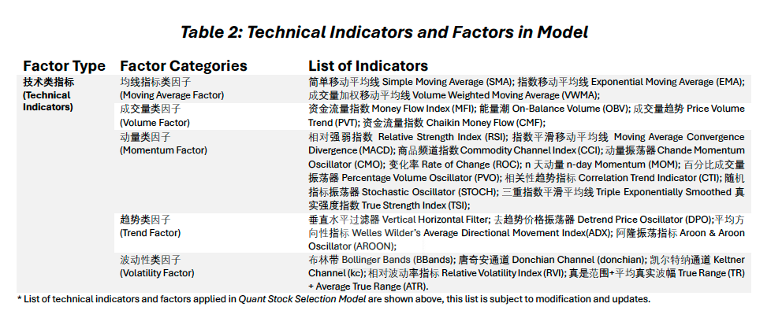

# 技术指标搭建 Technical Indicators Construction 


<span style="color:red;font-weight:700;font-size:18px">Internal Version, DO NOT disseminate!</span>  
  
<span style="color:red;font-weight:700;font-size:18px">内部版本 请勿外传!</span> 


As previously defined, technical analysis is the recording of the actual trading history, to identify potential patterns/trends with the assumption that similar behavior will repeat in the future. A **technical indicator** is basically a mathematical and statistical representation and manipulation of the basic historical raw trading data and of an asset.   

The following content in $\S 3.1-\S 3.12$ exhibits the computation results, related charts, graphs/plots, and generated **daily trading signals** based on subjectively set (indicator) parameters for each of the **12** **technical indicators**. 

如前所述，技术分析是对实际交易历史的记录，以识别潜在的量价趋势，并假设相似的模式和表现将在未来重复出现。**技术指标**是对资产原始的历史量价交易数据进行数学和统计运算操作的一种表达式。

以下内容在$\S 3.1-\S 3.12$展示了12个**技术指标**的计算结果、相关图表、和所生成的**每日交易信号**。注：本章中技术指标所生成的交易信号皆基于主观设置的指标参数。   

Whether one **technical indicator** is effective is evaluated in $\S 4.1$ [Selecting Effective Technical Indicators 选取有效的技术指标]. Simulations for a portfolio constructed from the model-selected stocks will be performed and analyzed in $\S 4.1-\S4.3$ [基础模型选股表现 (Base) Model Performance].

Note: For all **technical indicators** utilized for this stock selection strategy, only the traditional (types of) technical analysis was applied; and there were no Machine Learning or AI enhanced directly for any indicators, nor any ML-driven evaluation processes included in selecting the **significant indicators**, refer the details in $\S 4.1$  [选取有效的技术指标（动态更新）Dynamic: Selecting Effective Technical Indicators]).    

有关评估一个**技术指标**的有效性可参考$\S 4.1$ [选取有效的技术指标（动态更新）Dynamic: Selecting Effective Technical Indicators]中。模型程序将对由策略选定的股票所构建的投资组合进行模拟和回测，并对相关结果进行分析，详情参考$\S 4.1-\S4.3$ [基础模型选股表现 (Base) Model Performance]。

注意：对于此量化选股策略中使用的所有**技术指标**，策略和模型仅运用了传统（类型）的技术分析方式；并没有直接为任何技术指标进行机器学习运算模拟或AI增强，亦没有在选取有效指标的过程中运用任何由机器学习驱动的评估过程（详情参考$\S 4.1$ [选取有效的技术指标（动态更新）Dynamic: Selecting Effective Technical Indicators]）。

* For example: the **RSI (Relative Strength Index)** is one of the most widely used **technical indicators**, to detect potential oversold and overbought trading signals. As one of the classical trading tools, the **RSI** has its defects. The **RSI** tends to under or over react in sudden market shifts. Nowadays, quantitive analysts and traders often utilizes the LSTM (Long short-term memory) framework, one of the RNN (Recurrent Neural Network) Deep Learning Models to enhance the **RSI** performance, and applies Bayesian Optimization on the parameter settings.  

* 例如：**RSI（相对强弱指标）**是最广泛使用的**技术指标**之一，用于检测和识别潜在的超卖和超买信号。作为经典的交易工具之一，**RSI**也有其缺陷。**RSI**在突然的市场变化(market shift)中往往会反应不足或过度。如今，量化分析师和交易员常常利用LSTM（长短期记忆）框架，一种RNN（循环神经网络）的深度学习模型来增强RSI的性能和表现，并应用贝叶斯优化对指标的参数设置进行优化。  

Starting at over 5,600+ stocks listed on *NYSE* and *NASDAQ*, and with eliminations by the **subjective indicators** (refer to $\S 2.2$ [其他组合相关过滤指标 Portfolio-specific Subjective Indicators]), about <span style="color:red;font-weight:700;font-size:18px">n</span> U.S. stocks are input for the **base stock selection model**, dominated by the **technical indicators**, for further model processes and screening.   

从在*纽约证券交易所(NYSE)*和*纳斯达克(NASDAQ)*上市的5,600多只股票开始，经过**主观指标**的筛选淘汰后(参考$\S 2.2$ [其他组合相关过滤指标 Portfolio-specific Subjective Indicators])，大约<span style="color:red;font-weight:700;font-size:18px">n</span>只美国股票进入以**技术指标**为主的**基础选股模型**中完成进一步的模型处理和筛选。

In general, the program is set to perform computations and to generate trading signals accordingly of all the indicators/factors for each input stock. However, without occupying the majority of report(*e-Manual*) spaces, all outputs (computation results, mathematical and statistical charts/tables, and plots/visualizations) are therefore suppressed. (A <span style="color:red;font-weight:700;font-size:18px">warning in red</span> is provided once an output is suppressed). For each model step across this entire *e-Manual*, the *pdf-version*  only shows the program output for **Apple, Inc.** (`AAPL.US`); similar applies to plots/visualizations of the *html-version* *e-Manual*.

A web-based application ([MAS-Stock Selection Webapp](https://webapp.multi-asset-strategy.cn)) has therefore been designed and deployed, so the PMs and analysts are able to check and analyze the **latest** updates on indicators/factors valuations, related charts and plots **for all stocks** within the model scale, along with the dynamically updated model results in a more interactive manner.  

This approach aims to enhance interactivity and accessibility through web applications, enabling PMs and analysts to access and evaluate the latest data and analytical results for all stocks within the model in real-time under all working environments. This not only improves the efficiency of analysis but also makes the decision-making process more flexible and accurate.

总的来说，选股策略模型的程序被设定为每只进入模型的股票执行所有指标/因子的计算并生成交易信号。然而，为了不占用报告（*量化模型搭建说明*）的大部分空间，所有输出（计算结果、数学和统计图表/表格以及图像/可视化）都已被抑制。（一旦某条输出被抑制，将提供一个<span style="color:red;font-weight:700;font-size:18px">红色警告</span>）。在整个*量化模型搭建说明*的每个模型步骤中，`pdf版本`仅显示**苹果公司 Apple, Inc.** (**AAPL.US**)的输出结果；`html版本`*量化模型搭建说明*中的图像/可视化也适用类似的规则。

因此，我们设计并部署了一个基于网页的应用程序（[MAS-Stock Selection Webapp](https://webapp.multi-asset-strategy.cn)），以便投资经理和研究员能够以更交互的方式检查和分析模型范围内所有股票的指标/因素估值、相关图表和图示的最新更新，以及动态更新的模型结果。这种做法旨在通过轻量级网络应用提高分析过程的交互性，使投资经理和研究员在不同工作环境中能够实时访问和评估模型内所有股票的最新数据和分析结果。这不仅提升了分析的效率，也使得决策过程更加灵活和准确。

```{r 300-1, echo=FALSE, message=FALSE, warning=FALSE}

```

```{r 300-2, message=FALSE, warning=FALSE, include=FALSE}
# Define function to read another rmd file
source_rmd <- function(file, local = FALSE, ...){
  options(knitr.duplicate.label = 'allow')

  tempR <- tempfile(tmpdir = ".", fileext = ".R")
  on.exit(unlink(tempR))
  knitr::purl(file, output=tempR, quiet = TRUE)

  envir <- globalenv()
  source(tempR, local = envir, ...)
}
```

```{r 300-3, message=FALSE, warning=FALSE, include=FALSE}
# Read in base model construction rmd to continue with 3.1
source_rmd("02_Base-Model-Construction.Rmd")
```


<div style="text-align: right;">
**返回目录  **[快速索引 Quick Table of Contents] 
</div>


<!-- Disclaimer section with a gray bar -->
<div style="width: 100%; height: 20px; background-color: grey;"></div>

<!-- Disclaimer Text -->
<div style="padding: 20px; margin-top: 20px; background-color: #f1f1f1;">
    内部资料，请勿外传! 

    Internal documents, please do not disseminate! 

    本网页模型搭建说明及模型网络应用仅供参考。无论是所含信息还是所表达的观点，
    均不得明示或暗示为任何形式的建议、提供、招揽、邀请、广告、诱导、推荐或代表，
    以买卖任何证券、金融工具或任何投资或其他特定产品。

    The web-based Quantitative Model e-Manual and web application are for information
    purposes only. The information and opinion contained and expressed herein, shall not,
    and shall not be deemed to, construed, expressly or impliedly, as advice, offer or
    solicitation of an offer, invitation, advertisement, inducement, recommendation, or
    representation of any kind or form whatsoever to buy or sell any security, financial
    instrument or any investment or other specific product.
</div>


