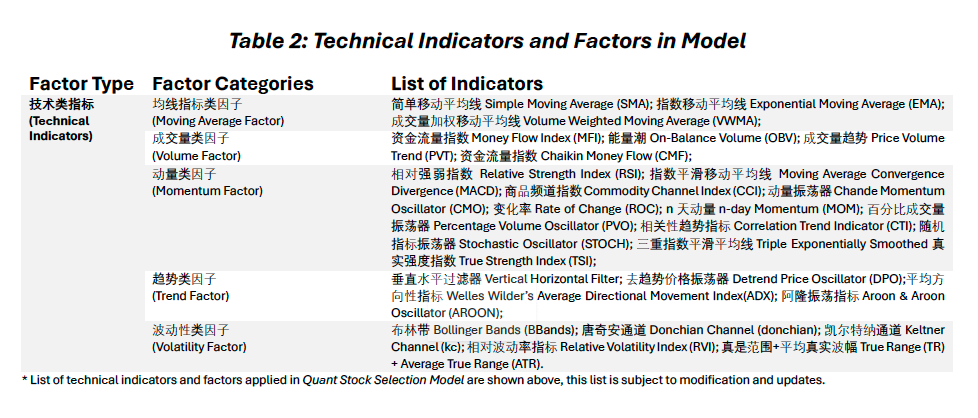

# 技术指标搭建 Technical Indicators Construction 

```{r message=FALSE, warning=FALSE, include=FALSE}
library(bookdown)

html_chapters(
  toc = TRUE,
  number_sections = TRUE,
  fig_caption = TRUE,
  lib_dir = "libs",
  global_numbering = !number_sections,
  pandoc_args = NULL,
  base_format = rmarkdown::html_document,
  split_bib = TRUE,
  page_builder = build_chapter,
  split_by = c("section+number", "section", "chapter+number", "chapter", "rmd", "none")
)
```

```{r eval=FALSE, include=FALSE}
<span style="color:red;font-weight:700;font-size:28px">DEMO ONLY: Internal Version</span>  
<span style="color:red;font-weight:700;font-size:28px">内部版本 请勿外传</span> 
```

As previously defined, technical analysis is the recording of the actual trading history, to identify potential patterns/trends with the assumption that similar behavior will repeat in the future. A **technical indicator** is basically a mathematical and statistical representation and manipulation of the basic historical raw trading data and of an asset.   

The following content in $\S 3.1-\S 3.12$ exhibits the computation results, related charts, graphs/plots, and generated **daily trading signals** based on subjectively set (indicator) parameters for each of the **12** **technical indicators**. 

如前所述，技术分析是对实际交易历史的记录，以识别潜在的量价趋势，并假设相似的模式和表现将在未来重复出现。**技术指标**是对资产原始的历史量价交易数据进行数学和统计运算操作的一种表达式。

以下内容在$\S 3.1-\S 3.12$展示了12个**技术指标**的计算结果、相关图表、和所生成的**每日交易信号**。注：本章中技术指标所生成的交易信号皆基于主观设置的指标参数。   

Whether one **technical indicator** is effective is evaluated in $\S 4.1$ [Selecting Effective Technical Indicators 选取有效的技术指标]. Simulations for a portfolio constructed from the model-selected stocks will be performed and analyzed in $\S 4.1-\S4.3$ [基础模型选股表现 (Base) Model Performance].

Note: For all **technical indicators** utilized for this stock selection strategy, only the traditional (types of) technical analysis was applied; and there were no Machine Learning or AI enhanced directly for any indicators, nor any ML-driven evaluation processes included in selecting the **significant indicators**, refer the details in $\S 4.1$  [选取有效的技术指标（动态更新）Dynamic: Selecting Effective Technical Indicators]).    

有关评估一个**技术指标**的有效性可参考$\S 4.1$ [选取有效的技术指标（动态更新）Dynamic: Selecting Effective Technical Indicators]中。模型程序将对由策略选定的股票所构建的投资组合进行模拟和回测，并对相关结果进行分析，详情参考$\S 4.1-\S4.3$ [基础模型选股表现 (Base) Model Performance]。

注意：对于此量化选股策略中使用的所有**技术指标**，策略和模型仅运用了传统（类型）的技术分析方式；并没有直接为任何技术指标进行机器学习运算模拟或AI增强，亦没有在选取有效指标的过程中运用任何由机器学习驱动的评估过程（详情参考$\S 4.1$ [选取有效的技术指标（动态更新）Dynamic: Selecting Effective Technical Indicators]）。

* For example: the **RSI (Relative Strength Index)** is one of the most widely used **technical indicators**, to detect potential oversold and overbought trading signals. As one of the classical trading tools, the **RSI** has its defects. The **RSI** tends to under or over react in sudden market shifts. Nowadays, quantitive analysts and traders often utilizes the LSTM (Long short-term memory) framework, one of the RNN (Recurrent Neural Network) Deep Learning Models to enhance the **RSI** performance, and applies Bayesian Optimization on the parameter settings.  

* 例如：**RSI（相对强弱指标）**是最广泛使用的**技术指标**之一，用于检测和识别潜在的超卖和超买信号。作为经典的交易工具之一，**RSI**也有其缺陷。**RSI**在突然的市场变化(market shift)中往往会反应不足或过度。如今，量化分析师和交易员常常利用LSTM（长短期记忆）框架，一种RNN（循环神经网络）的深度学习模型来增强RSI的性能和表现，并应用贝叶斯优化对指标的参数设置进行优化。  

Starting at over 5,600+ stocks listed on *NYSE* and *NASDAQ*, and with eliminations by the **subjective indicators** (refer to $\S 2.2$ [其他组合相关过滤指标 Portfolio-specific Subjective Indicators]), about <span style="color:red;font-weight:700;font-size:18px">n</span> U.S. stocks are input for the **base stock selection model**, dominated by the **technical indicators**, for further model processes and screening.   

从在*纽约证券交易所(NYSE)*和*纳斯达克(NASDAQ)*上市的5,600多只股票开始，经过**主观指标**的筛选淘汰后(参考$\S 2.2$ [其他组合相关过滤指标 Portfolio-specific Subjective Indicators])，大约<span style="color:red;font-weight:700;font-size:18px">n</span>只美国股票进入以**技术指标**为主的**基础选股模型**中完成进一步的模型处理和筛选。

In general, the program is set to perform computations and to generate trading signals accordingly of all the indicators/factors for each input stock. However, without occupying the majority of report(*e-Manual*) spaces, all outputs (computation results, mathematical and statistical charts/tables, and plots/visualizations) are therefore suppressed. (A <span style="color:red;font-weight:700;font-size:18px">warning in red</span> is provided once an output is suppressed). For each model step across this entire *e-Manual*, the *pdf-version*  only shows the program output for **Apple, Inc.** (`AAPL.US`); similar applies to plots/visualizations of the *html-version* *e-Manual*.

A web-based application ([MAS-Stock Selection Webapp](https://webapp.multi-asset-strategy.cn)) has therefore been designed and deployed, so the PMs and analysts are able to check and analyze the **latest** updates on indicators/factors valuations, related charts and plots **for all stocks** within the model scale, along with the dynamically updated model results in a more interactive manner.  

This approach aims to enhance interactivity and accessibility through web applications, enabling PMs and analysts to access and evaluate the latest data and analytical results for all stocks within the model in real-time under all working environments. This not only improves the efficiency of analysis but also makes the decision-making process more flexible and accurate.

总的来说，选股策略模型的程序被设定为每只进入模型的股票执行所有指标/因子的计算并生成交易信号。然而，为了不占用报告（*量化模型搭建说明*）的大部分空间，所有输出（计算结果、数学和统计图表/表格以及图像/可视化）都已被抑制。（一旦某条输出被抑制，将提供一个<span style="color:red;font-weight:700;font-size:18px">红色警告</span>）。在整个*量化模型搭建说明*的每个模型步骤中，`pdf版本`仅显示**苹果公司 Apple, Inc.** (**AAPL.US**)的输出结果；`html版本`*量化模型搭建说明*中的图像/可视化也适用类似的规则。

因此，我们设计并部署了一个基于网页的应用程序（[MAS-Stock Selection Webapp](https://webapp.multi-asset-strategy.cn)），以便投资经理和研究员能够以更交互的方式检查和分析模型范围内所有股票的指标/因素估值、相关图表和图示的最新更新，以及动态更新的模型结果。这种做法旨在通过轻量级网络应用提高分析过程的交互性，使投资经理和研究员在不同工作环境中能够实时访问和评估模型内所有股票的最新数据和分析结果。这不仅提升了分析的效率，也使得决策过程更加灵活和准确。

```{r 300-1, echo=FALSE, message=FALSE, warning=FALSE}

```

```{r 300-2, message=FALSE, warning=FALSE, include=FALSE}
# Define function to read another rmd file
source_rmd <- function(file, local = FALSE, ...){
  options(knitr.duplicate.label = 'allow')

  tempR <- tempfile(tmpdir = ".", fileext = ".R")
  on.exit(unlink(tempR))
  knitr::purl(file, output=tempR, quiet = TRUE)

  envir <- globalenv()
  source(tempR, local = envir, ...)
}
```

```{r 300-3, message=FALSE, warning=FALSE, include=FALSE}
# Read in base model construction rmd to continue with 3.1
source_rmd("02_Base-Model-Construction.Rmd")
```


## <span style="color:blue">技术指标1：简单移动平均线 Technical Indicator 1: Simple Moving Average (SMA)</span> 


Includes `tsignal1`, `tsignal2`, and `tsignal3`

包括交易信号 `tsignal1`, `tsignal2`, 以及 `tsignal3`

### **SMA**简介 Intro- **SMA**: 

Commonly, traders intend to observe the average stock prices for the past set duration or periods (days, weeks, months), which is commonly defined as the moving average price or the rolling average price.  

An n-day **Simple Moving Average** price, or the **n-day SMA** price, refers to the **arithmetic average** or the **simple average** of the stock prices for the past n consecutive trading days. This model uses the daily *adjusted close* prices for the computation.  

The **SMA** lines tend to smooth out volatility or price variations, and makes the visualization of price trends more clear and intuitive.

交易者通常试图观察过去一段时间（天、周、月）的平均股价，这通常被定义为移动平均价或滚动平均价。

n日**简单移动平均**价格，或**n日SMA**价格，指的是过去n个连续交易日股价的**算术平均数**或**简单平均数**。本模型使用日*调整收盘价*进行计算。

**SMA**线倾向于平滑波动性或价格变化，并使价格趋势的可视化更加清晰和直观。

Mathematically defined as: 数学上定义为：

$$\text{SMA}_t=\frac{P_t+...+P_{t-n+1}}{n}=\frac{\sum^{t}_{i=t-n+1}P_i}{n}$$

The program uses the formula above to compute the **Simple Moving Average (SMA)** values for **all stocks** in the model with various parameter settings, and creates appropriate related visualizations. The **SMA**-based **daily trading signals** will then be constructed from the subjectively set trading rules.  

选股模型程序使用上述公式计算模型中**所有股票**的在多个不同的参数设定下的**简单移动平均（SMA）**值，并创建相应的可视化图表。然后，根据主观设定的交易规则构建**SMA****日交易信号**。

```{r 301-1, message=FALSE, warning=FALSE, include=FALSE}
# Define a function to compute the value for SMA using the adjusted close price with parameter settings of n days 

SMA_comput <- function(price, n){
  sma <- rep(NA, length(price)) 
  if (length(price) >= n) {  # Only compute SMA if enough data points are available
    for (i in n:length(price)){
      sma[i] <- mean(price[(i-n+1):i])
    }
  }
  return(sma)
}
```

```{r 301-2, message=FALSE, warning=FALSE, include=FALSE}
# Compute SMA for all stocks
mega7data_modified <-
  mega7data_modified %>%
  group_by(symbol) %>%
  mutate(SMA5 = SMA_comput(adjusted, 5), 
         SMA8 = SMA_comput(adjusted,8),
         SMA13 = SMA_comput(adjusted,13),
         SMA20 = SMA_comput(adjusted,20),
         SMA50 = SMA_comput(adjusted,50),
         SMA200 = SMA_comput(adjusted,200))
```

```{r 301-3, message=FALSE, warning=FALSE, include=FALSE}
# Alternative way: 
# Below utilizes the `TTR` package directly for SMA computations: SMA()
# AAPL <- xts(sma_value_result_pdf$adjusted,sma_value_result_pdf$date)
# SMA20 <- SMA(AAPL,n = 20) 
```

```{r 301-4, message=FALSE, warning=FALSE, include=FALSE}
sma_value_result <- 
  mega7data_modified %>%
  mutate(date = as.Date(date)) %>%
  select(date, adjusted, SMA5, SMA8, SMA13, 
         SMA20, SMA50, SMA200, volume) %>%
  arrange(desc(date)) %>%
  head(5000)

sma_value_result_pdf <- 
  mega7data_modified %>%
  slice(which(symbol == "AAPL")) %>%
  mutate(date = as.Date(date)) %>%
  select(date, adjusted, SMA5, SMA8, SMA13, 
         SMA20, SMA50, SMA200, volume) %>%
  arrange(desc(date))
```

```{r 301-5, eval=FALSE, message=FALSE, warning=FALSE, include=FALSE}
# ##### [Code Hidden 代码已隐藏]{style="color:red"} {-}

# ##### [Individual stock outputs are suppressed, only `AAPL.US` related results are shown for illustration purposes. Refer to the *webapp* or the `html` version of the *e-Manual* for complete outputs. 个股输出数据及图表已隐藏，报告仅展示`苹果公司(AAPL.US)`的相关结果,完整图表可参阅*webapp* 或网页版*Global MAS 量化模型搭建说明*。]{style="color:red"} {-}

# pdf output
# Display AAPL output (SMA values)
kbl(head(sma_value_result_pdf,10), booktabs = T, linesep = '', digits = 1,
    caption = "SMA Computations for AAPL.US",
    format.args = list(big.mark = ",", scientific = FALSE),
    col.names = c("Symbol","Date","Adj Close","SMA5","SMA8",
                  "SMA13","SMA20","SMA50","SMA200","Volume")) %>%
  kable_styling(latex_options = c("striped", "scale_down",
                                  "HOLD_position"), 
                position = "center") %>%
  column_spec(c(1,4:9), bold = T) %>%
  kableExtra::footnote(general = "Output 3.1.a: Latest 10 rows of data are shown.")
```

##### [Code Hidden 代码已隐藏]{style="color:red"} {-}

##### [Enter the ticker/symbol in the search box for stock-specific results. Sort tool is available next to the variable names. 搜索框中输入股票代码可以过滤展示个股相关结果。点击变量名旁的箭头可进行排序。]{style="color:purple"} {-}

```{r 301-6, echo=FALSE, message=FALSE, warning=FALSE}
# html output
# Display SMA values
DT::datatable(sma_value_result, 
              colnames = c('Symbol' = 2, 'Date' = 3, 'Adjusted' = 4, 'Volume' = 11),
              caption = htmltools::tags$caption(style = 'caption-side: top; 
                                            text-align: center; color: black; 
                                            font-size: 200%;',
                                            'SMA Computations'),
              options = list(pageLength = 10, lengthMenu = c(5, 10, 15, 20),
              searching = TRUE, style = list(width = '100%')), extensions = 'Buttons') %>%
  formatRound(columns = c('Adjusted','SMA5','SMA8','SMA13','SMA20','SMA50','SMA200'),
              digits = 2)  %>%
  formatRound(columns = 'Volume', digits = 0)
```

Output 3.1.a: **SMA** Computations, latest 10 rows of data are shown.  

图表 3.1.a: **SMA** 计算结果，展示最新的 10 行数据。

</br>

The program computed the **SMA** values for all stocks input in the model, with the parameter settings of $n=5,8,13,20,50,200$. As an illustration, above table shows the computed **SMA** values and plots (end of section). 

模型程序为输入的所有股票计算了**SMA**值，参数设定为$n=5,8,13,20,50,200$。作为示例，上表展示了计算的**SMA**值并创建了可视化图表（节末）。

```{r 301-7, message=FALSE, warning=FALSE, include=FALSE}
# Data manipulation for SMA plot AAPL.US
sma_aapl_xts <- 
  mega7data_modified %>%
  slice(which(symbol == "AAPL")) %>%
  #mutate(date = as.POSIXct(date)) %>%
  select(date, open, high, low, close, volume, adjusted) %>%
  na.omit()

open <- sma_aapl_xts$open
high <- sma_aapl_xts$high
low <- sma_aapl_xts$low
close <- sma_aapl_xts$close
adjusted <- sma_aapl_xts$adjusted
volume <- as.numeric(sma_aapl_xts$volume)

sma_aapl_xts <- xts(cbind(open, high, low, close, volume, adjusted),
                   as.POSIXct(sma_aapl_xts$date))
sma_aapl_xts <- last(sma_aapl_xts,'365 days')

```

```{r 301-8, eval=FALSE, message=FALSE, warning=FALSE, include=FALSE}
##### AAPL Plot include SMA5, SMA8, and SMA13 using `TTR` package {-}
# pdf plot
# SMA plot AAPL.US p.1 SMA5 SMA8 SMA13
chartSeries(sma_aapl_xts,
            type = "candlesticks",
            theme = chartTheme('black'))

addSMA(n = c(5, 8, 13), on = 1,
       col = c("white","yellow", "purple"), overlay = TRUE)
```

```{r 301-9, eval=FALSE, message=FALSE, warning=FALSE, include=FALSE}
##### AAPL Plot include SMA50, and SMA200
# pdf plot
# SMA plot AAPL.US p.2 SMA50 SMA200
chartSeries(sma_aapl_xts,
            type="candlesticks",
            theme = chartTheme('black'))

addSMA(n = c(50,200), on = 1,
       col = c("grey","blue"), overlay = TRUE)
```


### 交易信号与策略- **SMA** Trading signal(s) & strategies- **SMA**:

Normally, when a short-run **SMA** crosses from below to above a longer-run **SMA** is an indication to **BUY**. When a short-run **SMA** crosses from above to below a longer-run **SMA** is an indication to **SELL**.  

通常，当短期**SMA**从下方穿越至长期**SMA**的上方时，视为**买入**的信号。当短期**SMA**从上方穿越至长期**SMA**下方时，视为**卖出**的信号。

* 1. **SMA** Trading Signal #1: $\text{close price}>\text{SMA}(20)$ (Price relative to **SMA**) [`tsignal1`]     

* 1. **SMA** 交易信号#1: $\text{收盘价}>\text{SMA}(20)$（价格相对于**SMA**）[`tsignal1`]

When the most recent closing price (the model uses the *adjusted close* prices) is above its *SMA20* indicates a **BUY** signal, and vice versa for a **SELL** signal. We consider when $\text{close price}>\text{SMA}(20)$, the stock is currently trading at a strength relative to its recent (over a month) price history, otherwise the stock is currently trading weakly.  

当最近的收盘价（模型使用*调整收盘价*）高于其*SMA20*时，视为一个**买入**的信号，反之亦然表示一个**卖出**信号。我们认为当$\text{收盘价}>\text{SMA}(20)$时，股票当前价格相较于其近期（超过一个月）的历史价格呈现出强势表现，反之当前交易价格呈现为弱势。


* 2. **SMA** Trading Signal #2: $\text{SMA}(50)>\text{SMA}(200)$ (Hierarchical Moving Average Alignment) [`tsignal2`]  
* 2. **SMA** 交易信号#2: $\text{SMA}(50)>\text{SMA}(200)$（层次化移动平均对齐）[`tsignal2`]

Above mathematical expression is not completely accurate, where we believe when *SMA50* crosses from below to above a 200-day **Simple Moving Average** (*SMA200*) indicates the stock prices are stable and established an uptrend trend, i.e. a **BUY** signal. When the *SMA50* crosses from above to below a *SMA200* indicates a **SELL** signal.  

Note, this is one of the most classical **SMA** trading strategies, commonly refers to as the 'golden cross' and 'death cross'.   

上述数学表达式不完全准确，我们认为当*SMA50*从下方穿越至200日**简单移动平均线**(*SMA200*)上方时，表示股价相对稳定且处于上升通道，即视为一个**买入**信号。当*SMA50*从上方穿越至*SMA200*下方时，视为一个**卖出**信号。这是最经典的**SMA**交易策略之一，通常被称为“金叉”和“死叉”。

* 3. **SMA** Trading Signal #3: $\text{SMA}(8)>\text{SMA}(13)$ & $\text{SMA}(5)>\text{SMA}(8)$ (Short-to-medium term Moving Average Alignment) [`tsignal3`]  
* 3. **SMA** 交易信号#3: $\text{SMA}(8)>\text{SMA}(13)$ 且 $\text{SMA}(5)>\text{SMA}(8)$ （中短期移动平均对齐） [`tsignal3`]

Above mathematical expression is not completely accurate either, where we believe when the *SMA8* crosses from below to above a 13-day **Simple Moving Average** (*SMA13*) indicates the stock prices are in an upward trend for the medium term. If concurrently, the *SMA5* crosses from below to above a *SMA8*, which indicates the stock prices are in an upward trend for the short-to-medium term; a **BUY** opportunity is signaled.

In contrast, when the *SMA8* crosses from above to below an *SMA13*, and concurrently the *SMA5* crosses from above to below the *SMA8*, indicates a **SELL** signal for the short-to-medium term.

上述数学表达式同样并不完全准确，我们认为当*SMA8*从下方穿越至13日**简单移动平均线**(*SMA13*)上方时，表示股价在中期内呈现上升趋势。如果同时，*SMA5*从下方穿越至*SMA8*上方，表示股价在短至中期内在上升通道中；视为是一个**买入**的机会。

相反，当*SMA8*从上方穿越至*SMA13*下方，并同时*SMA5*从上方穿越至*SMA8*下方时，视为短至中期的**卖出**信号。

### **SMA**策略交易信号汇总 To summarize for **SMA** trading signals: 

While comparison between *SMA50* and *SMA200* is the more classical and widely used parameter setting for the **Simple Moving Average** (**SMA**) indicator, namely the golden and death crosses. The less conventional, however modern and effective short-to-medium term trend indicator setting is applying the combinations of $n=5,8,13$.  
虽然*SMA50*与*SMA200*的比较是**简单移动平均**（**SMA**）指标更为经典且是一组被广泛使用的参数设定，即金叉和死叉。但较相对不常规、却现代且有效的短至中期趋势指标的设定是应用$n=5,8,13$的组合。

-   **SMA**- `tsignal1`:\
    **BUY**: $\text{close price}>\text{SMA}(20)$,\
    **SELL**: $\text{close price}\leq \text{SMA}(20)$;  

- **SMA**交易信号- `tsignal1`:\
    **买入**: $\text{收盘价}>\text{SMA}(20)$,\
    **卖出**: $\text{收盘价}\leq \text{SMA}(20)$;

-   **SMA**- `tsignal2`:\
    **BUY**: $\text{SMA}(50)$ cross from **below to above** $\text{SMA}(200)$,\
    **SELL**: $\text{SMA}(50)$ cross from **above to below** $\text{SMA}(200)$, \
    **HOLD**: otherwise;  
    
- **SMA**交易信号- `tsignal2`:\
    **买入**: $\text{SMA}(50)$ **从下方穿越至** $\text{SMA}(200)$**上方**,\
    **卖出**: $\text{SMA}(50)$ **从上方穿越至** $\text{SMA}(200)$**下方**,\
    **持有**: 其他情况;

-   **SMA**- `tsignal3`:\
    **BUY**: $\text{SMA}(8)$ cross from **below to above** a $\text{SMA}(13)$ **and** $\text{SMA}(5)$ cross from **below to above** a $\text{SMA}(8)$,\
    **SELL**: $\text{SMA}(8)$ cross from **above to below** a $\text{SMA}(13)$ **and** $\text{SMA}(5)$ cross from **above to below** a $\text{SMA}(8)$, \
    **HOLD**: otherwise.  
    
- **SMA**交易信号- `tsignal3`:\
    **买入**: $\text{SMA}(8)$ **从下方穿越至** $\text{SMA}(13)$**上方并且** $\text{SMA}(5)$ **从下方穿越至** $\text{SMA}(8)$**上方**,\
    **卖出**: $\text{SMA}(8)$ **从上方穿越至** $\text{SMA}(13)$**下方并且** $\text{SMA}(5)$ **从上方穿越至** $\text{SMA}(8)$**下方**,\
    **持有**: 其他情况。

```{r 301-10, message=FALSE, warning=FALSE, include=FALSE}
# SMA Trading Signal 1: Price > SMA20
# SMA Trading Rule setup and Generate Signals 
mega7data_modified <-
  mega7data_modified %>%
  mutate(tsignal1 = case_when(SMA20 < adjusted ~ 'BUY',
                              SMA20 >= adjusted ~ 'SELL'))
```

```{r 301-11, message=FALSE, warning=FALSE, include=FALSE}
# SMA Trading Signal 2: SMA50 > SMA200
# SMA Trading Rule setup and Generate Signals 
mega7data_modified <- 
  mega7data_modified %>%
  group_by(symbol) %>%
  mutate(tsignal2 = case_when(
    lag(SMA50) < lag(SMA200) & SMA50 > SMA200 ~ 'BUY',
    lag(SMA50) >= lag(SMA200) & SMA50 < SMA200 ~ 'SELL',
    lag(SMA50) < lag(SMA200) & SMA50 <= SMA200 ~ 'HOLD',
    lag(SMA50) >= lag(SMA200) & SMA50 >= SMA200 ~ 'HOLD'))
```

```{r 301-12, message=FALSE, warning=FALSE, include=FALSE}
# SMA Trading Signal 3a: SMA5 > SMA8
# SMA Trading Signal 3b: SMA8 > SMA13
# SMA Trading Rule setup and Generate Signals 
mega7data_modified <- 
  mega7data_modified %>%
  group_by(symbol) %>%
  mutate(tsignal3a = case_when(
    lag(SMA5) < lag(SMA8) & SMA5 > SMA8 ~ 'BUY',
    lag(SMA5) >= lag(SMA8) & SMA5 < SMA8 ~ 'SELL',
    lag(SMA5) < lag(SMA8) & SMA5 <= SMA8 ~ 'HOLD',
    lag(SMA5) >= lag(SMA8) & SMA5 >= SMA8 ~ 'HOLD')) %>%
  mutate(tsignal3b = case_when(
    lag(SMA8) < lag(SMA13) & SMA8 > SMA13 ~ 'BUY',
    lag(SMA8) >= lag(SMA13) & SMA8 < SMA13 ~ 'SELL',
    lag(SMA8) < lag(SMA13) & SMA8 <= SMA13 ~ 'HOLD',
    lag(SMA8) >= lag(SMA13) & SMA8 >= SMA13 ~ 'HOLD'))
```

```{r 301-13, message=FALSE, warning=FALSE, include=FALSE}
# SMA Trading Signal 3: only when 3a & 3b are the SAME (simultaneously)
# SMA Trading Rule setup and Generate Signals 
mega7data_modified <- 
  mega7data_modified %>%
  mutate(tsignal3 = case_when(
    tsignal3a == 'BUY' & tsignal3b == 'BUY' ~ 'BUY',
    tsignal3a == 'BUY' & tsignal3b == 'SELL' ~ 'HOLD',
    tsignal3a == 'BUY' & tsignal3b == 'HOLD' ~ 'HOLD',
    tsignal3a == 'HOLD' & tsignal3b == 'HOLD' ~ 'HOLD',
    tsignal3a == 'HOLD' & tsignal3b == 'BUY' ~ 'HOLD',
    tsignal3a == 'HOLD' & tsignal3b == 'SELL' ~ 'HOLD',
    tsignal3a == 'SELL' & tsignal3b == 'BUY' ~ 'HOLD',
    tsignal3a == 'SELL' & tsignal3b == 'SELL' ~ 'SELL',
    tsignal3a == 'SELL' & tsignal3b == 'HOLD' ~ 'HOLD')) 
```

```{r 301-14, message=FALSE, warning=FALSE, include=FALSE, paged.print=TRUE}
# Prepare data frame SMA signal results
sma_signal_result <-
  mega7data_modified %>%
  select(date, symbol, adjusted, tsignal1, tsignal2, 
         tsignal3, tsignal3a, tsignal3b) %>%
  arrange(desc(date))

# For AAPL signals results (SMA)
sma_signal_result_pdf <-
  mega7data_modified %>%
  slice(which(symbol == "AAPL")) %>%
  ungroup() %>%
  select(date, symbol, adjusted, tsignal1, tsignal2, 
         tsignal3, tsignal3a, tsignal3b) %>%
  arrange(desc(date)) %>%
  head(10)
```

```{r 301-15, eval=FALSE, fig.pos='H', message=FALSE, warning=FALSE, include=FALSE}
# ##### [Code Hidden 代码已隐藏]{style="color:red"} {-}

# ##### [Individual stock outputs are suppressed, only `AAPL.US` related results are shown for illustration purposes. Refer to the *webapp* or the `html` version of the *e-Manual* for complete outputs. 个股输出数据及图表已隐藏，报告仅展示`苹果公司(AAPL.US)`的相关结果,完整图表可参阅*webapp* 或网页版*Global MAS 量化模型搭建说明*。]{style="color:red"} {-}

# pdf output
# Display AAPL signal results (SMA signals)
kbl(sma_signal_result_pdf, booktabs = T, linesep = "", longtable = T, 
    digits = 1, caption = "SMA Trading Signals for AAPL.US", 
    format.args = list(big.mark = ",", scientific = FALSE),
    col.names = c("Date","Symbol","Adj Close","tsignal1","tsignal2",
                  "tsignal3","tsignal3a","tsignal3b")) %>%
  kable_styling(latex_options = c("striped", "scale_up",
                                  "HOLD_position"),
                full_width = F) %>%
  column_spec(c(2,4:6), bold = T) %>%
  column_spec(1, width = "1.9cm") %>%
  kableExtra::footnote(general = "Output 3.1.b: latest 10 rows of data are shown.",
              number = "Includes tsignal1, tsignal2, tsignal3, tsignal3a and tsignal3b.")
#图表3.1.b: SMA交易信号，展示最新的10行数据。包括`tsignal1`, `tsignal2`, `tsignal3`, #`tsignal3a`和`tsignal3b`。
```

##### [Code Hidden 代码已隐藏]{style="color:red"} {-}

##### [Enter the ticker/symbol in the search box for stock-specific results. Sort tool is available next to the variable names. 搜索框中输入股票代码可以过滤展示个股相关结果。点击变量名旁的箭头可进行排序。]{style="color:purple"} {-}

```{r 301-16, echo=FALSE, message=FALSE, warning=FALSE}
# html output
# Display SMA signal results 
DT::datatable(head(sma_signal_result,5000), 
              colnames = c('Date' = 2, 'Symbol' = 3, 'Adjusted' = 4),
              caption = htmltools::tags$caption(style = 'caption-side: top; 
                                            text-align: center; color: black; 
                                            font-size: 200%;',
                                            'SMA Trading Signals'),
              options = list(pageLength = 10, lengthMenu = c(5, 10, 15, 20),
              searching = TRUE, style = list(width = '100%')), extensions = 'Buttons') %>%
    formatRound(columns = 'Adjusted', digits = 2)  
```

Output 3.1.b: **SMA**trading signals, latest 10 rows of data are shown. Includes `tsignal1`, `tsignal2`, `tsignal3`, `tsignal3a` and `tsignal3b`.  

图表3.1.b: **SMA**交易信号，展示最新的10行数据。包括`tsignal1`, `tsignal2`, `tsignal3`, `tsignal3a`和`tsignal3b`。

```{r 301-17, echo=FALSE, message=FALSE, warning=FALSE}
# pdf output
# SMA Candlestick+Volume Plot for AAPL with trading signals
# Prepare the dataset for candlestick components
sma_signal_plot_pdf<- 
  mega7data_modified %>%
  slice(which(symbol == "AAPL")) %>%
  select(date, symbol, adjusted, open, close, high, low, volume, SMA5, 
         SMA8, SMA13, SMA20, SMA50, SMA200, tsignal1, tsignal2, tsignal3) %>%
  mutate(date = as.Date(date, format = "%Y-%m-%d"),
         day_trend_color = ifelse(open - adjusted > 0, "red", "green")) %>%
  filter(as.Date(date) > as.Date(Sys.Date()-months(12)))
```

```{r 301-18, eval=FALSE, fig.height=7, fig.width=10, message=FALSE, warning=FALSE, include=FALSE}
# pdf output
# SMA Candlestick+Volume Plot for AAPL with trading signals

# Candlestick Plot with SMA Trading Signals
color_values <- c(
  "SMA5" = "black", 
  "SMA8" = "yellow", 
  "SMA13" = "purple", 
  "SMA20" = "red", 
  "SMA50" = "grey", 
  "SMA200" = "blue",
  "green" = "darkgreen", 
  "red" = "red",
  "Signal1 BUY " = "lightgreen", 
  "Signal1 SELL" = "deeppink",
  "Signal2 BUY" = "lightgreen", 
  "Signal2 SELL" = "deeppink",
  "Signal3 BUY" = "lightgreen", 
  "Signal3 SELL" = "deeppink"
)

candlestick <- 
  ggplot(sma_signal_plot_pdf, aes(x = date)) +
  geom_segment(aes(xend = date, y = open, 
                   yend = adjusted, colour = day_trend_color), size = 5) +
  geom_segment(aes(xend = date, y = high, 
                   yend = low, colour = day_trend_color)) +
  geom_line(aes(y = SMA5, color = "SMA5"), size = 0.5) +
  geom_line(aes(y = SMA8, color = "SMA8"), size = 0.5) +
  geom_line(aes(y = SMA13, color = "SMA13"), size = 0.5) +
  geom_line(aes(y = SMA20, color = "SMA20"), size = 0.5) +
  geom_line(aes(y = SMA50, color = "SMA50"), size = 0.5) +
  geom_line(aes(y = SMA200, color = "SMA200"), size = 0.5) +

  # Adding trading signals with different shapes and colors
  geom_point(data = filter(sma_signal_plot_pdf, tsignal1 == "BUY"),
             aes(x = date, y = high, color = "Signal1 BUY", 
                 shape = "Signal1 BUY"), size = 2) +
  geom_point(data = filter(sma_signal_plot_pdf, tsignal1 == "SELL"), 
             aes(x = date, y = low, color = "Signal1 SELL", 
                 shape = "Signal1 SELL"), size = 2) +
  geom_point(data = filter(sma_signal_plot_pdf, tsignal2 == "BUY"), 
             aes(x = date, y = high, color = "Signal2 BUY", 
                 shape = "Signal2 BUY"), size = 2) +
  geom_point(data = filter(sma_signal_plot_pdf, tsignal2 == "SELL"), 
             aes(x = date, y = low, color = "Signal2 SELL", 
                 shape = "Signal2 SELL"), size = 2) +
  geom_point(data = filter(sma_signal_plot_pdf, tsignal3 == "BUY"), 
             aes(x = date, y = high, color = "Signal3 BUY", 
                 shape = "Signal3 BUY"), size = 2) +
  geom_point(data = filter(sma_signal_plot_pdf, tsignal3 == "SELL"), 
             aes(x = date, y = low, color = "Signal3 SELL", 
                 shape = "Signal3 SELL"), size = 2) +
  theme(legend.position = "top",
            guides(color = guide_legend(nrow = 4, byrow = TRUE, 
                                title = "Indicators & Signals"), 
    shape = guide_legend(nrow = 4, byrow = TRUE, title = "Trade Signals") 
  )) +
  scale_color_manual(name = "Indicators & Signals", values = color_values) +
  scale_shape_manual(name = "Signal Shapes", 
                     values = c("Signal1 BUY" = 17, "Signal1 SELL" = 4, 
                                "Signal2 BUY" = 18, "Signal2 SELL" = 3, 
                                "Signal3 BUY" = 15, "Signal3 SELL" = 1)) +
  labs(
    y = "Stock Price, in USD", x = "Date") +
    labs(title = paste0("Price Volume Candlestick Plot for AAPL.US \
       with SMA Lines and Trading Signals")) +
  theme_bw() +
  scale_x_date(date_breaks = "2 months", date_labels = "%b %Y")

# Volume Plot
volume_plot <- 
  ggplot(sma_signal_plot_pdf, aes(x = date, y = volume, fill = day_trend_color)) +
  geom_bar(stat = "identity") +
  scale_fill_manual(values = c("green" = "darkgreen", "red" = "red")) +
  labs(y = "Daily Trading Volume", x = "Date") +
  theme_bw() +
  theme(legend.position = "none",
            guides(color = guide_legend(nrow = 4, byrow = TRUE, 
                                title = "Indicators & Signals"), 
    shape = guide_legend(nrow = 4, byrow = TRUE, title = "Trade Signals") 
  )) +
  scale_x_date(date_breaks = "2 months", date_labels = "%b %Y") +
  scale_y_continuous(labels = scales::comma)


# Combine 2 plots
ggarrange(candlestick, volume_plot, ncol = 1, nrow = 2,
    heights =c(9,3), widths = 10, align = "v") 

# Output 3.1.c: SMA plot with trading signals on Price and Volume, duration setting TTM.
```

```{r 301-19, echo=FALSE, message=FALSE, warning=FALSE}
# html output
# plotly interactive plot
# SMA Candlestick+Volume Plot for AAPL with trading signals
# Prepare the dataset 

sma_signal_plot_html<- 
  mega7data_modified %>%
  slice(which(symbol == "AAPL")) %>%
  select(date, symbol, adjusted, open, close, high, low, volume, SMA5, 
         SMA8, SMA13, SMA20, SMA50, SMA200, tsignal1, tsignal2, tsignal3) %>%
  mutate(date = as.Date(date, format = "%Y-%m-%d"),
         day_trend_color =  ifelse(open < adjusted, "lightgreen", "red"),
         prev_adjusted = lag(adjusted),
         prev_volume = lag(volume),
         volume_color = ifelse(volume > prev_volume, "orange", "lightblue"),
         hover_text_volume = paste(
      "<b>Symbol:</b>", symbol, "<br>",
      "<b>Date:</b>", format(date, '%Y-%m-%d'), "<br>",
      "<b>Daily Volume:</b>", formatC(volume, big.mark = ","),
       "<span style='color:", 
      ifelse(volume > prev_volume, "darkgreen", "red"), ";'>",
      ifelse(volume > prev_volume, "▲", "▼"), "</span>", "<br>")) %>% 
 filter(as.Date(date) > as.Date(Sys.Date()-months(12)))

# Define shapes for each signal
signal_shapes <- list(
  "Signal1 BUY" = "circle",
  "Signal1 SELL" = "circle-open",
  "Signal2 BUY" = "triangle-up",
  "Signal2 SELL" = "triangle-down-open",
  "Signal3 BUY" = "diamond",
  "Signal3 SELL" = "diamond-open"
)

sma_signal_plot_html <- sma_signal_plot_html %>%
  mutate(hover_text = paste(
    "<b>Symbol:</b>", symbol, "<br>",
    "<b>Date:</b>", format(date, '%Y-%m-%d'), "<br>",
    "<b>Adjusted Close Price:</b> $", round(adjusted, 2), "<br>",
    "<span style='color:", 
    ifelse(adjusted > prev_adjusted, "darkgreen", "pink"), ";'>",
      ifelse(adjusted > prev_adjusted, "▲", "▼"), "</span>", "<br>",
    "<b>Open:</b> $", round(open, 2), "<br>",
    "<b>High:</b> $", round(high, 2), "<br>",
    "<b>Low:</b> $", round(low, 2), "<br>",
    "<b>Volume:</b>", formatC(volume, format = "f", big.mark = ","),
      "<span style='color:", 
      ifelse(volume > prev_volume, "darkgreen", "red"), ";'>",
      ifelse(volume > prev_volume, "▲", "▼"), "</span>", "<br>"
  ))
```

##### [Code Hidden 代码已隐藏]{style="color:red"} {-}

##### [Individual stock outputs are suppressed, only `AAPL.US` related results are shown for illustration purposes. Refer to the *webapp* for the complete plot output. 个股输出数据及图表已隐藏，报告仅展示`苹果公司(AAPL.US)`的相关结果,完整图表可参阅*webapp*。]{style="color:red"} {-}

```{r 301-20, echo=FALSE, fig.height=7, fig.width=12, message=FALSE, warning=FALSE}
# html output
# plotly interactive plot
# SMA Price Candlestick Plot for AAPL with trading signals

# Candlestick Plot with SMA Trading Signals
fig <- plot_ly(data = sma_signal_plot_html, type = "candlestick", 
               x = ~date, open = ~open, close = ~adjusted, high = ~high, low = ~low,
               increasing = list(line = list(color = "darkgreen", width = 10), 
                                 fillcolor = "darkgreen"),
               decreasing = list(line = list(color = "red", width = 10), 
                                 fillcolor = "red"), 
               hoverinfo = "text", text = ~hover_text, showlegend = FALSE) %>%
  add_lines(y = ~SMA5, name = "SMA5", line = list(color = "black"), showlegend = TRUE,
            hoverinfo = "y+text", 
            hovertemplate = paste("<b>Date:</b> %{x|%Y-%m-%d}<br><b>SMA5:</b> %{y:.2f}<extra></extra>")) %>%
  add_lines(y = ~SMA8, name = "SMA8", line = list(color = "yellow"),  showlegend = TRUE,
            hoverinfo = "y+text", 
            hovertemplate = paste("<b>Date:</b> %{x|%Y-%m-%d}<br><b>SMA8:</b> %{y:.2f}<extra></extra>")) %>%
  add_lines(y = ~SMA13, name = "SMA13", line = list(color = "purple"), showlegend = TRUE,
            hoverinfo = "y+text", 
            hovertemplate = paste("<b>Date:</b> %{x|%Y-%m-%d}<br><b>SMA13:</b> %{y:.2f}<extra></extra>")) %>%
  add_lines(y = ~SMA20, name = "SMA20", line = list(color = "red"), showlegend = TRUE,
            hoverinfo = "y+text", 
            hovertemplate = paste("<b>Date:</b> %{x|%Y-%m-%d}<br><b>SMA20:</b> %{y:.2f}<extra></extra>")) %>%
  add_lines(y = ~SMA50, name = "SMA50", line = list(color = "grey"),  showlegend = TRUE,
            hoverinfo = "y+text", 
            hovertemplate = paste("<b>Date:</b> %{x|%Y-%m-%d}<br><b>SMA50:</b> %{y:.2f}<extra></extra>")) %>%
  add_lines(y = ~SMA200, name = "SMA200", line = list(color = "blue"), showlegend = TRUE,
            hoverinfo = "y+text", 
            hovertemplate = paste("<b>Date:</b> %{x|%Y-%m-%d}<br><b>SMA200:</b> %{y:.2f}<extra></extra>")) %>%
  add_markers(data = filter(sma_signal_plot_html, tsignal1 == "BUY"), 
              x = ~date, y = ~high, 
              marker = list(color = "lightgreen", size = 6,
                            symbol = signal_shapes[["Signal1 BUY"]]), 
              name = "Signal1 BUY", showlegend = TRUE,
              hoverinfo = "text",
              hovertemplate = 
                "<b>Date:</b> %{x|%Y-%m-%d}<br><b>Signal1 BUY</b><extra></extra>") %>%
  add_markers(data = filter(sma_signal_plot_html, tsignal1 == "SELL"), 
              x = ~date, y = ~low, 
              marker = list(color = "pink", size = 6,
                            symbol = signal_shapes[["Signal1 SELL"]]), 
              name = "Signal1 SELL", showlegend = TRUE,
              hoverinfo = "text",
              hovertemplate = 
                "<b>Date:</b> %{x|%Y-%m-%d}<br><b>Signal1 SELL</b><extra></extra>") %>%
  add_markers(data = filter(sma_signal_plot_html, tsignal2 == "BUY"), 
              x = ~date, y = ~high, 
              marker = list(color = "lightgreen", size = 6,
                            symbol = signal_shapes[["Signal2 BUY"]]), 
              name = "Signal2 BUY",  showlegend = TRUE,
              hoverinfo = "text",
              hovertemplate = 
                "<b>Date:</b> %{x|%Y-%m-%d}<br><b>Signal2 BUY</b><extra></extra>") %>%
  add_markers(data = filter(sma_signal_plot_html, tsignal2 == "SELL"), 
              x = ~date, y = ~low, 
              marker = list(color = "pink", size = 6,
                            symbol = signal_shapes[["Signal2 SELL"]]), 
              name = "Signal2 SELL", showlegend = TRUE,
              hoverinfo = "text",
              hovertemplate = 
                "<b>Date:</b> %{x|%Y-%m-%d}<br><b>Signal2 SELL</b><extra></extra>") %>%
  add_markers(data = filter(sma_signal_plot_html, tsignal3 == "BUY"), 
              x = ~date, y = ~high, 
              marker = list(color = "lightgreen", size = 6,
                            symbol = signal_shapes[["Signal3 BUY"]]), 
              name = "Signal3 BUY", showlegend = TRUE,
              hoverinfo = "text",
              hovertemplate = 
                "<b>Date:</b> %{x|%Y-%m-%d}<br><b>Signal3 BUY</b><extra></extra>") %>%
  add_markers(data = filter(sma_signal_plot_html, tsignal3 == "SELL"), 
              x = ~date, y = ~low, 
              marker = list(color = "pink", size = 6,
                            symbol = signal_shapes[["Signal3 SELL"]]), 
              name = "Signal3 SELL", showlegend = TRUE,
              hoverinfo = "text",
              hovertemplate = 
                "<b>Date:</b> %{x|%Y-%m-%d}<br><b>Signal3 SELL</b><extra></extra>") %>%
  layout(title = list(text = "Interactive Price Candlestick Plot for AAPL.US with SMA Lines and Trading Signals",
                      x = 0.5,  
                      y = 0.9,  
                      xanchor = 'center',
                      yanchor = 'top'),
         xaxis = list(title = "Date", 
                      type = "date", 
                      rangeslider = list(visible = TRUE),
                      rangeselector = list(
                        buttons = list(
                          list(count = 1, label = "1w", 
                               step = "week", stepmode = "backward"),
                          list(count = 2, label = "2w", 
                               step = "week", stepmode = "backward"),
                          list(count = 1, label = "1m", 
                               step = "month", stepmode = "backward"),
                          list(count = 6, label = "6m", 
                               step = "month", stepmode = "backward"),
                          list(count = 12, label = "TTM", 
                               step = "month", stepmode = "backward"),
                          list(count = 1, label = "YTD",
                               step = "year", stepmode = "todate"),
                          list(count = 1, label = "1y", 
                               step = "year", stepmode = "backward"),
                          list(step = "all")
                      )
                    )),
         yaxis = list(title = "Stock Price, in USD", fixedrange = FALSE),
         legend = list(orientation = "h",x = 0, y = -0.6, 
                       xanchor = "left", yanchor = "top", traceorder = "normal"),
         margin = list(t = 100, b = 200),
         width = 800, height = 600)

fig
```

Output 3.1.c: Interactive **SMA** plot with trading signals on Price, duration setting TTM.  

图表 3.1.c: 交互式**SMA**股价图表，包括**SMA**策略交易信号，时间设置为TTM。

##### [Code Hidden 代码已隐藏]{style="color:red"} {-}

##### [Individual stock outputs are suppressed, only `AAPL.US` related results are shown for illustration purposes. Refer to the *webapp* for the complete plot output. 个股输出数据及图表已隐藏，报告仅展示`苹果公司(AAPL.US)`的相关结果,完整图表可参阅*webapp*。]{style="color:red"} {-}


```{r 301-21, echo=FALSE, message=FALSE, warning=FALSE}
# html output
# plotly interactive plot
# SMA Volume Plot for AAPL with trading signals
# Define signal colors and shapes for trading signals

volume_plot <- plot_ly(data = sma_signal_plot_html, 
                       x = ~date, y = ~volume, type = 'bar', 
                       marker = list(color = ~volume_color),
                       hoverinfo = 'text', text = ~hover_text_volume,
                       name = "Trading Volume") %>%
  layout(title = list(text = "Interactive Daily Trading Volume Plot for AAPL.US \
                      with SMA Lines and Trading Signals", 
                      x = 0.5, y = 0.95, 
                      xanchor = 'center', yanchor = 'top'),
         xaxis = list(title = "Date", type = "date", rangeslider = list(visible = TRUE),
                      rangeselector = list(
                        buttons = list(
                          list(count = 1, label = "1w", 
                               step = "week", stepmode = "backward"),
                          list(count = 2, label = "2w", 
                               step = "week", stepmode = "backward"),
                          list(count = 1, label = "1m", 
                               step = "month", stepmode = "backward"),
                          list(count = 6, label = "6m", 
                               step = "month", stepmode = "backward"),
                          list(count = 12, label = "TTM", 
                               step = "month", stepmode = "backward"),
                          list(count = 1, label = "YTD",
                               step = "year", stepmode = "todate"),
                          list(count = 1, label = "1y", 
                               step = "year", stepmode = "backward"),
                          list(step = "all")
                      )
                    )),
         yaxis = list(title = "Daily Trading Volume", fixedrange = FALSE, side = "left"),
         yaxis2 = list(title = "Daily SMA Values", 
                       overlaying = "y", side = "right", 
                       showgrid = FALSE,titlefont = list(size = 14)),
         barmode = 'group',
         legend = list(orientation = "h", x = 0.5, y = -0.4, 
                       xanchor = "center", yanchor = "top"),
         margin = list(l = 40, r = 40,b = 100, t = 100, pad = 4), height = 450)

vol_signal_colors <- c("BUY" = "lightgreen", "SELL" = "pink")
signals <- c("tsignal1", "tsignal2", "tsignal3")

for (sig in signals) {
  volume_plot <- volume_plot %>%
    add_markers(data = sma_signal_plot_html %>% 
                  filter(get(sig) == "BUY"), 
                x = ~date, y = ~volume, 
                marker = list(color = vol_signal_colors[["BUY"]], 
                              size = 10, symbol = "circle"),
                name = paste(sig, "BUY"),
                hoverinfo = "text",
                hovertemplate = paste("<b>Date:</b> %{x|%Y-%m-%d}<br><b>", 
                                      sig, "BUY</b><extra></extra>")) %>%
    add_markers(data = sma_signal_plot_html %>% filter(get(sig) == "SELL"), 
                x = ~date, y = ~volume, 
                marker = list(color = vol_signal_colors[["SELL"]], 
                              size = 10, symbol = "x"),
                name = paste(sig, "SELL"),
                hoverinfo = "text",
                hovertemplate = paste("<b>Date:</b> %{x|%Y-%m-%d}<br><b>", 
                                      sig, "SELL</b><extra></extra>"))
}

sma_lines <- c("SMA5", "SMA8", "SMA13", "SMA20", "SMA50", "SMA200")

sma_colors <- c("SMA5" = "black", "SMA8" = "yellow",
                "SMA13" = "purple", "SMA20" = "red", 
                "SMA50" = "grey", "SMA200" = "blue")

for (sma in sma_lines) {
  volume_plot <- 
    volume_plot %>%
    add_lines(data = sma_signal_plot_html, 
          x = ~date, y = as.formula(paste0("~", sma)), name = sma, 
              line = list(color = sma_colors[sma]), yaxis = "y2",
              hoverinfo = "y", 
              hovertemplate = paste("<b>Date:</b> %{x|%Y-%m-%d}<br><b>", 
                                    sma, ":</b> %{y:.2f}<extra></extra>"))
}

volume_plot
```

Output 3.1.d: Interactive **SMA** plot with trading signals on Volume, duration setting TTM.  

输出 3.1.d: 交互式**SMA**成交量图表，包括**SMA**策略交易信号，时间设置为TTM。

### **SMA**总结 Summary- **SMA**: 

The program is now constructed to generate **daily trading signals** given by the **Simple Moving Average (SMA)** indicator values. The latest applied parameter settings and trading rules for the **SMA**-generated signals are summarized above. 

**Daily trading signals** from the **SMA** indicators, include `tsignal1`, `tsignal2` and `tsignal3` (combined from `tsignal3a` and `tsignal3b`), for all stocks are generated; and the results (data tables and plots) for `AAPL.US` are shown above as illustrations, refer to the *webapp* for the complete data tables and plots/visualizations outputs.

根据**简单移动平均（SMA）**指标值给出**每日交易信号**的模型程序现已构建完成。选股模型最新应用的指标参数设定和**SMA**策略生成的交易信号的相关分析和设定已在上述部分总结。

**SMA**指标的**每日交易信号**，包括`tsignal1`,`tsignal2`和`tsignal3`（由`tsignal3a`和`tsignal3b`组合而成），且已经为模型中所有的股票生成**每日交易信号**；并且以`苹果公司(AAPL.US)`的结果（数据表和图表）作为示例展示，完整图表可参阅*webapp*。 

$^*$ Whether the **SMA** indicator, or the trading signals `tsignal1`, `tsignal2` and `tsignal3` are effective in selecting stocks to construct a portfolio trading strategies with upsides, will be further analyzed by the model, and refer to **$\S 4.1$ ** [选取有效的技术指标（动态更新）Dynamic: Selecting Effective Technical Indicators] below for more details. 

$^*$ **SMA**指标或策略交易信号`tsignal1`,`tsignal2`和`tsignal3`在组合交易策略中是否具备有效选择上升潜力股票的能力，将由选股模型进一步分析，详情参考**$\S 4.1$ ** [选取有效的技术指标（动态更新）Dynamic: Selecting Effective Technical Indicators]。

\newpage


